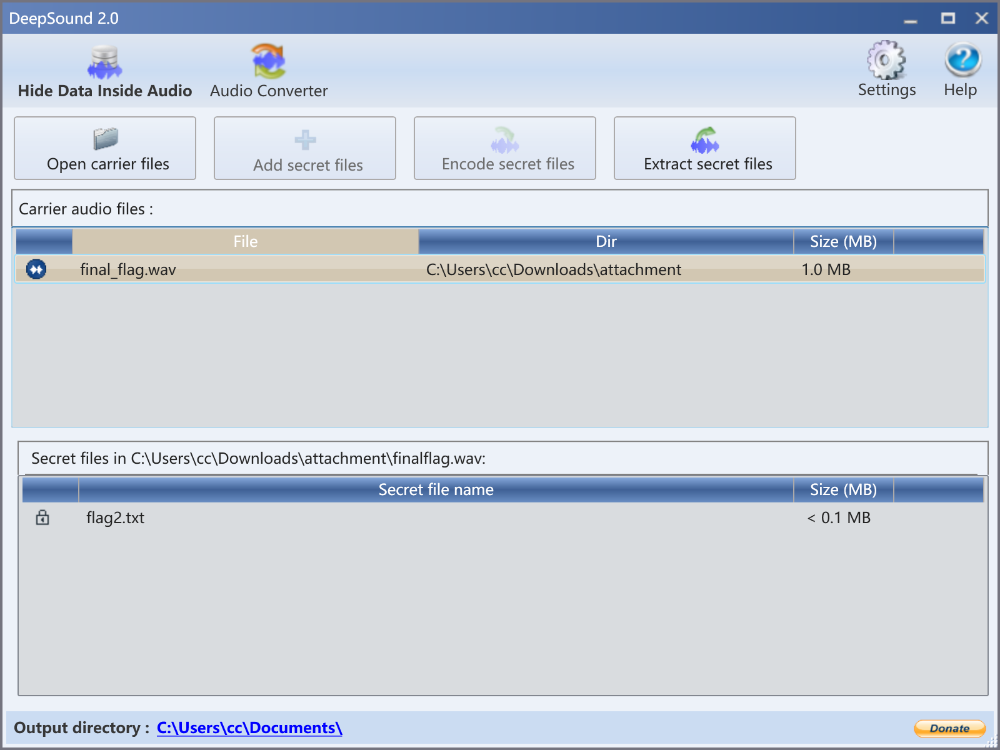
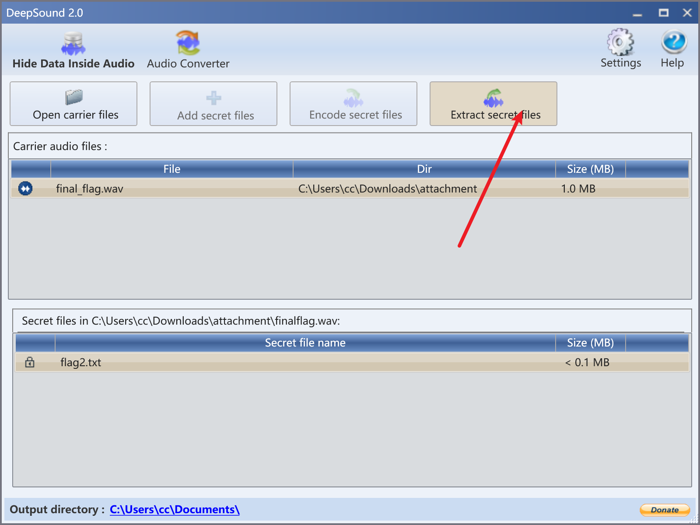

# [INSHack2018]not so deep

## 知识点

`audacity`

`DeepSound`

`DeepSound2John`

## 解题


`audacity`打开得到一半`flag`

`DeepSound2`

爆破密码脚本,`python3`

```python
#!/usr/bin/env python3
'''
deepsound2john extracts password hashes from audio files containing encrypted
data steganographically embedded by DeepSound (http://jpinsoft.net/deepsound/).

This method is known to work with files created by DeepSound 2.0.

Input files should be in .wav format. Hashes can be recovered from audio files
even after conversion from other formats, e.g.,

    ffmpeg -i input output.wav

Usage:

    python3 deepsound2john.py carrier.wav > hashes.txt
    john hashes.txt

This software is copyright (c) 2018 Ryan Govostes <rgovostes@gmail.com>, and
it is hereby released to the general public under the following terms:
Redistribution and use in source and binary forms, with or without
modification, are permitted.
'''

import logging
import os
import sys
import textwrap


def decode_data_low(buf):
  return buf[::2]

def decode_data_normal(buf):
  out = bytearray()
  for i in range(0, len(buf), 4):
    out.append((buf[i] & 15) << 4 | (buf[i + 2] & 15))
  return out

def decode_data_high(buf):
  out = bytearray()
  for i in range(0, len(buf), 8):
    out.append((buf[i] & 3) << 6     | (buf[i + 2] & 3) << 4 \
             | (buf[i + 4] & 3) << 2 | (buf[i + 6] & 3))
  return out


def is_magic(buf):
  # This is a more efficient way of testing for the `DSCF` magic header without
  # decoding the whole buffer
  return (buf[0] & 15)  == (68 >> 4) and (buf[2]  & 15) == (68 & 15) \
     and (buf[4] & 15)  == (83 >> 4) and (buf[6]  & 15) == (83 & 15) \
     and (buf[8] & 15)  == (67 >> 4) and (buf[10] & 15) == (67 & 15) \
     and (buf[12] & 15) == (70 >> 4) and (buf[14] & 15) == (70 & 15)


def is_wave(buf):
  return buf[0:4] == b'RIFF' and buf[8:12] == b'WAVE'


def process_deepsound_file(f):
  bname = os.path.basename(f.name)
  logger = logging.getLogger(bname)

  # Check if it's a .wav file
  buf = f.read(12)
  if not is_wave(buf):
    global convert_warn
    logger.error('file not in .wav format')
    convert_warn = True
    return
  f.seek(0, os.SEEK_SET)

  # Scan for the marker...
  hdrsz = 104
  hdr = None

  while True:
    off = f.tell()
    buf = f.read(hdrsz)
    if len(buf) < hdrsz: break

    if is_magic(buf):
          hdr = decode_data_normal(buf)
          logger.info('found DeepSound header at offset %i', off)
          break

    f.seek(-hdrsz + 1, os.SEEK_CUR)

  if hdr is None:
    logger.warn('does not appear to be a DeepSound file')
    return

  # Check some header fields
  mode = hdr[4]
  encrypted = hdr[5]

  modes = {2: 'low', 4: 'normal', 8: 'high'}
  if mode in modes:
    logger.info('data is encoded in %s-quality mode', modes[mode])
  else:
    logger.error('unexpected data encoding mode %i', modes[mode])
    return

  if encrypted == 0:
    logger.warn('file is not encrypted')
    return
  elif encrypted != 1:
    logger.error('unexpected encryption flag %i', encrypted)
    return

  sha1 = hdr[6:6+20]
  print('%s:$dynamic_1529$%s' % (bname, sha1.hex()))


if __name__ == '__main__':
  import argparse

  parser = argparse.ArgumentParser()
  parser.add_argument('--verbose', '-v', action='store_true')
  parser.add_argument('files', nargs='+', metavar='file',
    type=argparse.FileType('rb', bufsize=4096))
  args = parser.parse_args()

  if args.verbose:
    logging.basicConfig(level=logging.INFO)
  else:
    logging.basicConfig(level=logging.WARN)

  convert_warn = False

  for f in args.files:
    process_deepsound_file(f)

  if convert_warn:
    print(textwrap.dedent('''
    ---------------------------------------------------------------
    Some files were not in .wav format. Try converting them to .wav
    and try again. You can use: ffmpeg -i input output.wav
    ---------------------------------------------------------------
    '''.rstrip()), file=sys.stderr)
```


打开`DeepSound`输入密码






`INSA{Aud1o_st3G4n0_1s_4lwayS_Th3_S4me}`