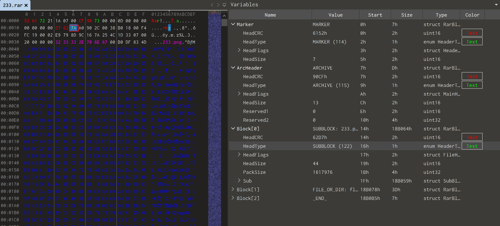
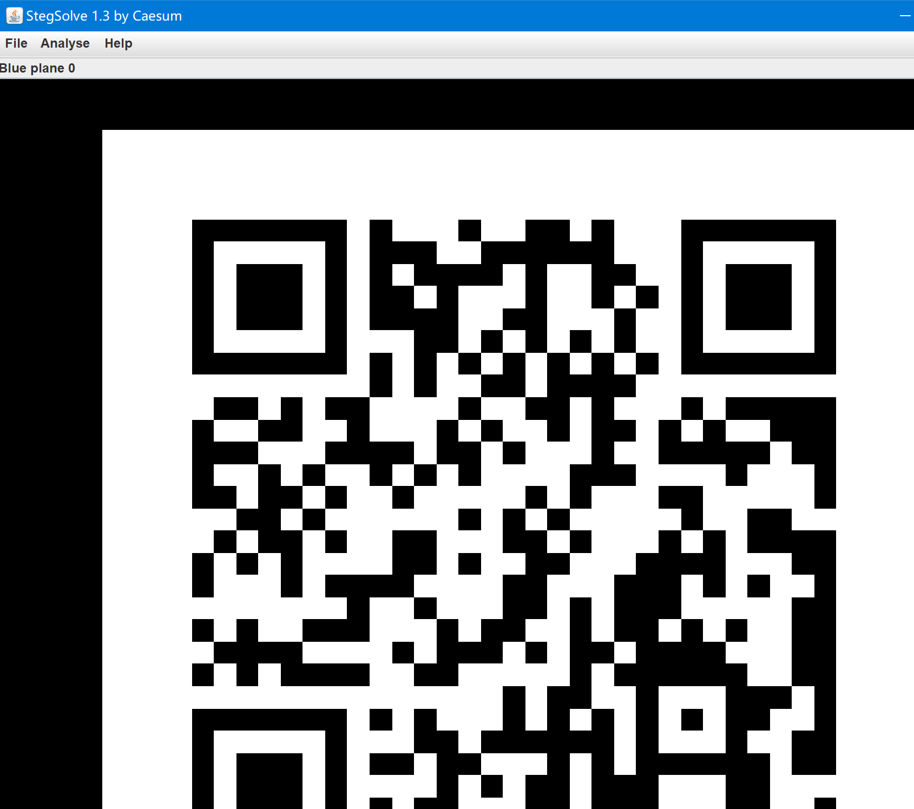

# USB

## 知识点

`图片隐写`

`USB流量分析`

`维吉尼亚解密后栅栏解密`

## 解题

虽然能正常解压,但文件头不对,`7A`改为`74`

```
52 61 72 21 1A 07 00 CF 90 73 00 00 0D 00 00 00 00 00 00 00 D7 62 74 A0 90 2C 00 38 B0
```



然后解压出`233.png`

用`stegsolve`打开



蓝色`0`通道发现一张二维码

扫描得到`ci{v3erf_0tygidv2_fc0}`

看起来是栅栏密码,但是没有`a`,无法构成`flag`

再看看`key.ftm`.`binwalk`看一下

发现`key.pcap`

全是`USB`协议

```bash
tshark -r key.pcap -T fields -e usb.capdata > usbdata.txt
```

导出`usbdata.txt`后跑脚本

```python
import sys
import os

DataFileName = "usb.dat"

presses = []

normalKeys = {"04":"a", "05":"b", "06":"c", "07":"d", "08":"e", "09":"f", "0a":"g", "0b":"h", "0c":"i", "0d":"j", "0e":"k", "0f":"l", "10":"m", "11":"n", "12":"o", "13":"p", "14":"q", "15":"r", "16":"s", "17":"t", "18":"u", "19":"v", "1a":"w", "1b":"x", "1c":"y", "1d":"z","1e":"1", "1f":"2", "20":"3", "21":"4", "22":"5", "23":"6","24":"7","25":"8","26":"9","27":"0","28":"<RET>","29":"<ESC>","2a":"<DEL>", "2b":"\t","2c":"<SPACE>","2d":"-","2e":"=","2f":"[","30":"]","31":"\\","32":"<NON>","33":";","34":"'","35":"<GA>","36":",","37":".","38":"/","39":"<CAP>","3a":"<F1>","3b":"<F2>", "3c":"<F3>","3d":"<F4>","3e":"<F5>","3f":"<F6>","40":"<F7>","41":"<F8>","42":"<F9>","43":"<F10>","44":"<F11>","45":"<F12>"}

shiftKeys = {"04":"A", "05":"B", "06":"C", "07":"D", "08":"E", "09":"F", "0a":"G", "0b":"H", "0c":"I", "0d":"J", "0e":"K", "0f":"L", "10":"M", "11":"N", "12":"O", "13":"P", "14":"Q", "15":"R", "16":"S", "17":"T", "18":"U", "19":"V", "1a":"W", "1b":"X", "1c":"Y", "1d":"Z","1e":"!", "1f":"@", "20":"#", "21":"$", "22":"%", "23":"^","24":"&","25":"*","26":"(","27":")","28":"<RET>","29":"<ESC>","2a":"<DEL>", "2b":"\t","2c":"<SPACE>","2d":"_","2e":"+","2f":"{","30":"}","31":"|","32":"<NON>","33":":","34":"\"","35":"<GA>","36":"<","37":">","38":"?","39":"<CAP>","3a":"<F1>","3b":"<F2>", "3c":"<F3>","3d":"<F4>","3e":"<F5>","3f":"<F6>","40":"<F7>","41":"<F8>","42":"<F9>","43":"<F10>","44":"<F11>","45":"<F12>"}

def main():
    # check argv
    if len(sys.argv) != 2:
        print("Usage : ")
        print("        python UsbKeyboardHacker.py data.pcap")
        print("Tips : ")
        print("        To use this python script , you must install the tshark first.")
        print("        You can use `sudo apt-get install tshark` to install it")
        print("Author : ")
        print("        WangYihang <wangyihanger@gmail.com>")
        print("        If you have any questions , please contact me by email.")
        print("        Thank you for using.")
        exit(1)

    # get argv
    pcapFilePath = sys.argv[1]
    
    # get data of pcap
    os.system("tshark -r %s -T fields -e usb.capdata 'usb.data_len == 8' > %s" % (pcapFilePath, DataFileName))

    # read data
    with open(DataFileName, "r") as f:
        for line in f:
            presses.append(line[0:-1])
    # handle
    result = ""
    for press in presses:
        if press == '':
            continue
        if ':' in press:
            Bytes = press.split(":")
        else:
            Bytes = [press[i:i+2] for i in range(0, len(press), 2)]
        if Bytes[0] == "00":
            if Bytes[2] != "00" and normalKeys.get(Bytes[2]):
                result += normalKeys[Bytes[2]]
        elif int(Bytes[0],16) & 0b10 or int(Bytes[0],16) & 0b100000: # shift key is pressed.
            if Bytes[2] != "00" and normalKeys.get(Bytes[2]):
                result += shiftKeys[Bytes[2]]
        else:
            print("[-] Unknow Key : %s" % (Bytes[0]))
    print("[+] Found : %s" % (result))

    # clean the temp data
    os.system("rm ./%s" % (DataFileName))


if __name__ == "__main__":
    main()
```

得到`KEYXINAN`

