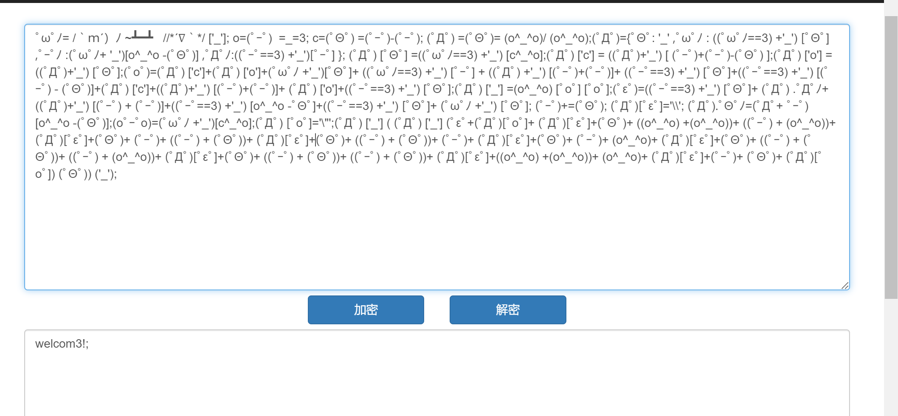
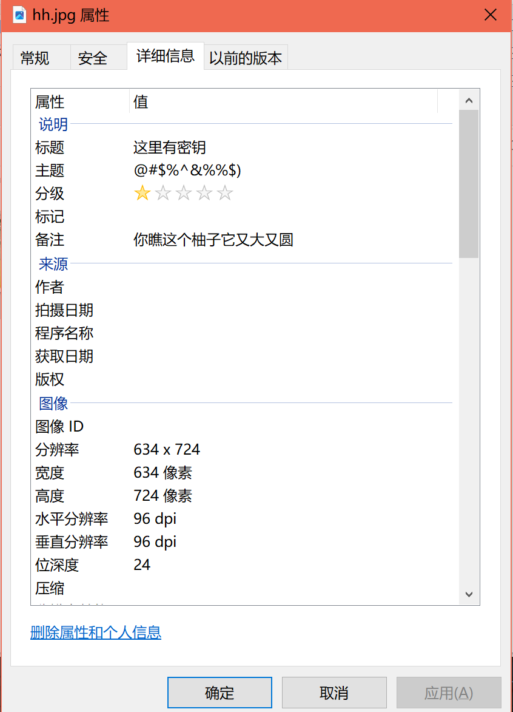
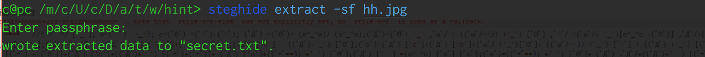
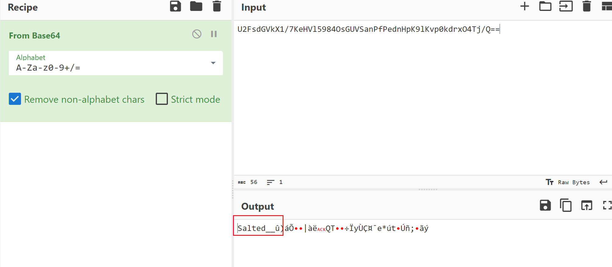
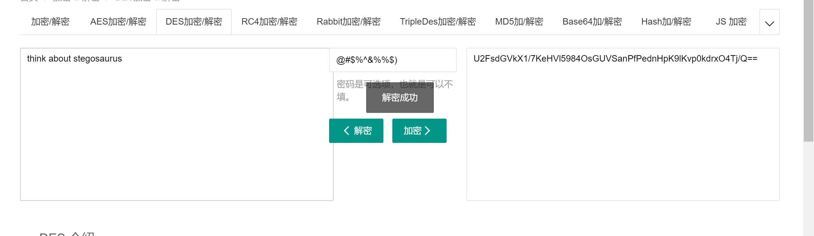
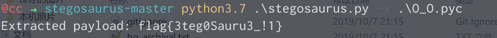

# [ACTF新生赛2020]剑龙

## 知识点

`stegosaurus`

## 解题

密码为`welcom3!;`

想要flag吗？解出我的密文吧~
`U2FsdGVkX1/7KeHVl5984OsGUVSanPfPednHpK9lKvp0kdrxO4Tj/Q==`

`Salted`开头,试试`AES`和`DES`

`python3 stegosaurus.py -x O_O.pyc`

记得改一下后缀名

