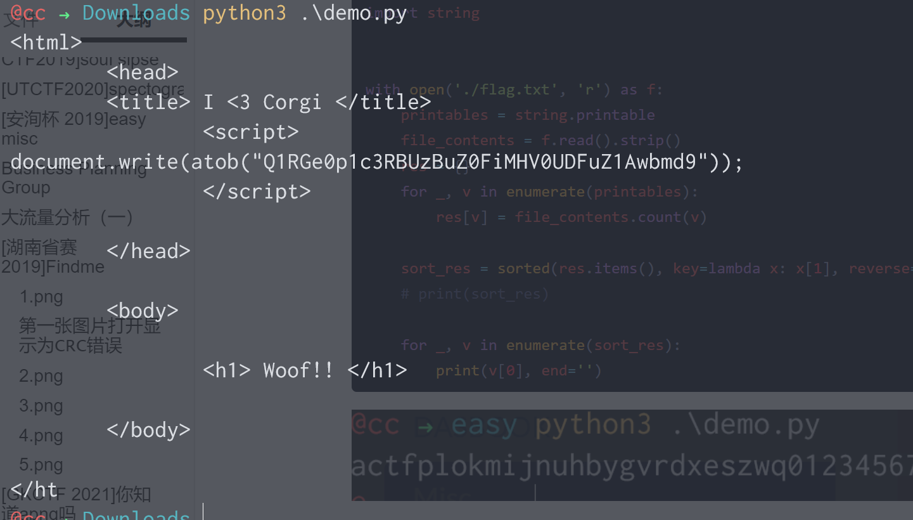

# [BSidesSF2019]table-tennis

## 知识点

`流量分析`

## 解题

### 方法一

python解析数据包

```python
from scapy.all import *
from scapy.layers.inet import ICMP

packets = rdpcap('./attachment.pcapng')
for pack in packets:    # 遍历每一个数据包
    if pack.haslayer(ICMP):
        if pack[ICMP].type == 0:  # 每一个ICMP的type值为0的包(响应包)
            print(pack[ICMP].load[-8:].decode(), end='')
            # 每个数据包的最后8位是有效数据
```



把其中的`base64`字符串取出来，然后解码一下就得到了flag。

### 方法二

提取的都是`16`进制，然后写个脚本处理一下

```bash
tshark -r attachment.pcapng -T fields -e data |sed '/^ *$/d' > data.txt
```

```python
file = open("data.txt","r")
str = ""
k = 1
for i in file.readlines():
    if (k%2==1):
        str += i[16:32]#有效数据段
    k += 1
str = str.replace("\n","")
# print(str)
for i in range(0,len(str),2):
    print(chr(int(str[i:i+2],16)),end="")
```

