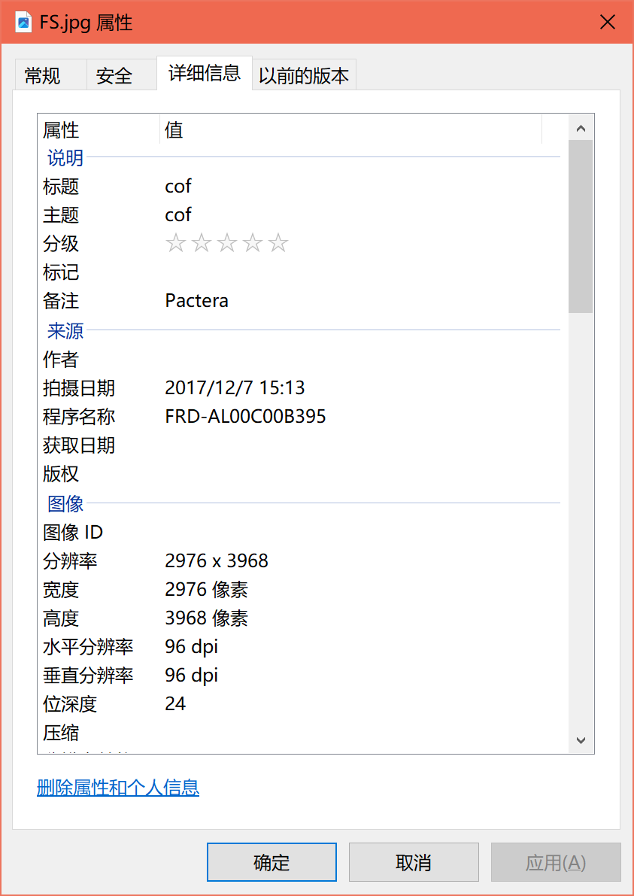
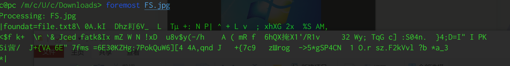
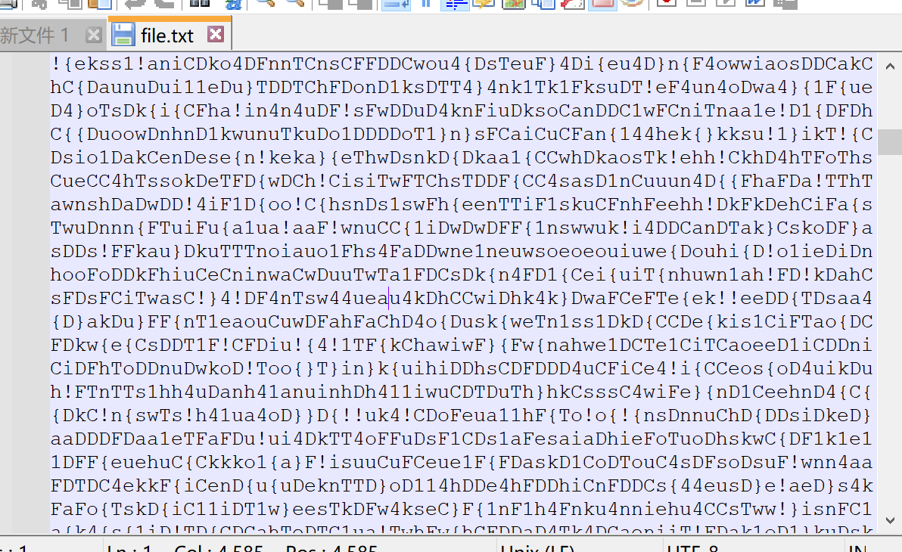

# [DDCTF2018]第四扩展FS

## 知识点

`foremost分离`

`频次统计`

## 解题

得到一张`jpg`


详细信息里面有内容



`foremost`分离一下



根据详细信息中的备注作为密码,解压出一个文件



频次统计

```python
from collections import Counter

with open('./file.txt', 'r') as f:
    cont = f.read()
    res = Counter(cont)
    print(''.join(res.keys()))
```


组合一下即可