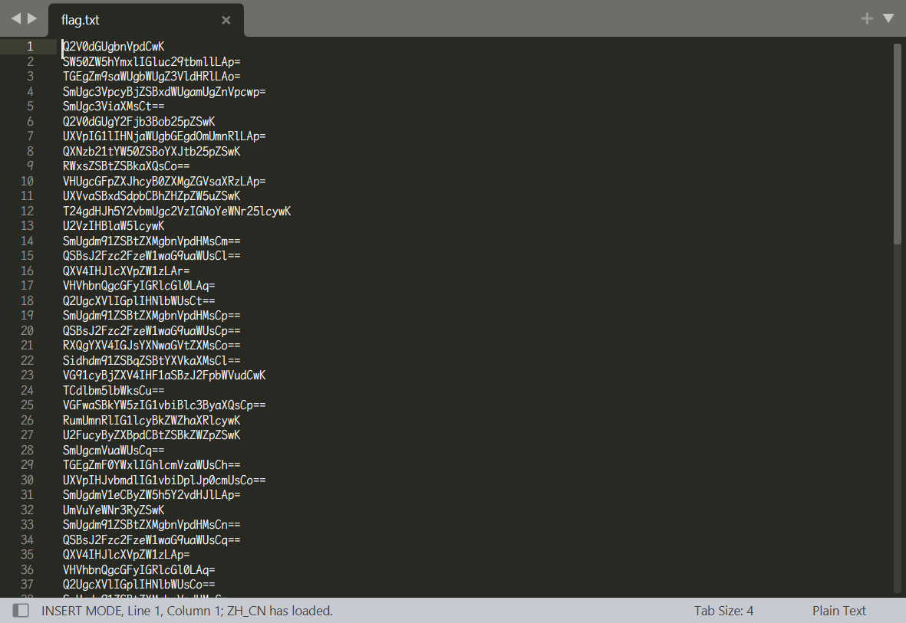

# [GXYCTF2019]SXMgdGhpcyBiYXNlPw==

## 知识点

`base64隐写`

## 解题

给了一个`flag.txt`,编写代码处理



```python
def get_base64_diff_value(s1, s2):
    base64chars = 'ABCDEFGHIJKLMNOPQRSTUVWXYZabcdefghijklmnopqrstuvwxyz0123456789+/'
    res = 0
    for i in xrange(len(s2)):
        if s1[i] != s2[i]:
            return abs(base64chars.index(s1[i]) - base64chars.index(s2[i]))
    return res


def solve_stego():
    with open('flag.txt', 'rb') as f:
        file_lines = f.readlines()
        bin_str = ''
        for line in file_lines:
            steg_line = line.replace('\n', '')
            norm_line = line.replace('\n', '').decode('base64').encode('base64').replace('\n', '')
            diff = get_base64_diff_value(steg_line, norm_line)
            print diff
            pads_num = steg_line.count('=')
            if diff:
                bin_str += bin(diff)[2:].zfill(pads_num * 2)
            else:
                bin_str += '0' * pads_num * 2
            print goflag(bin_str)


def goflag(bin_str):
    res_str = ''
    for i in xrange(0, len(bin_str), 8):
        res_str += chr(int(bin_str[i:i + 8], 2))
    return res_str


if __name__ == '__main__':
    solve_stego()

```

`python2`运行