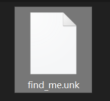
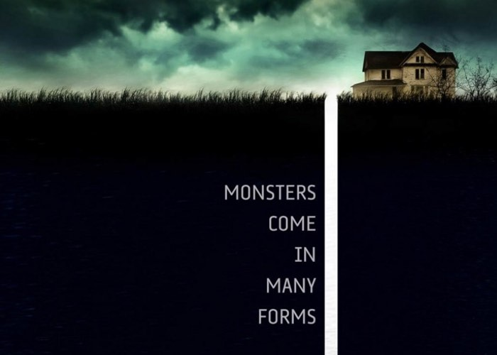
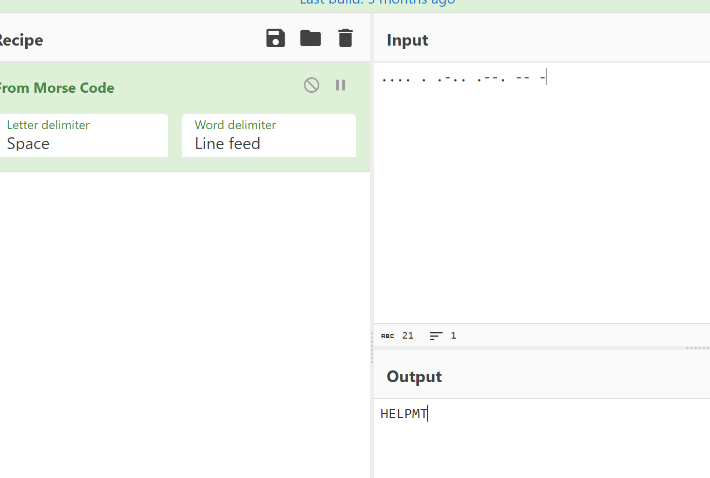
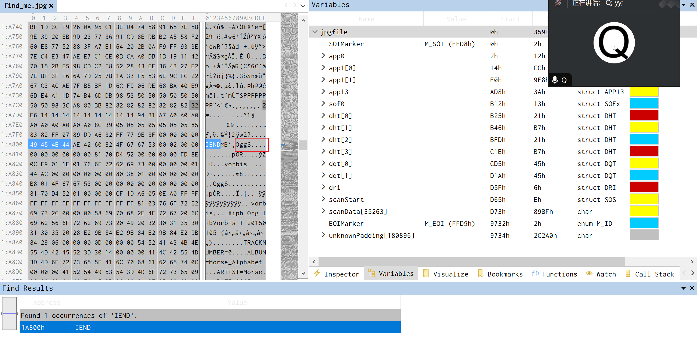
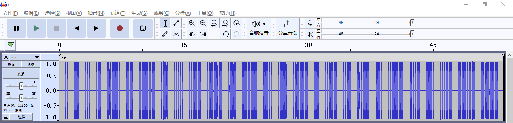

# [INSHack2017]10-cl0v3rf13ld-lane-signal

## 知识点

`.ogg`

`摩丝编码`

## 解题

题目给了后缀为`unk`的文件

`010editor`打开,发现文件头时`jpg`

更改后缀为`jpg`

没有什么东西,然后`010editor`继续看,发现了一个`png`的文件头,`binwalk`分离失败,使用`foremost`分离出一个文件

左下角有一部分`morse`编码

发现不全

再去原文件看看,原文件目前可以分为`3部分` `jpg ` `png` `未知文件` 查看一下`png`文件末尾,发现`Ogg`特征,复制保存为`.ogg`文件后用`audacity`打开

最后手搓`摩斯编码`即可