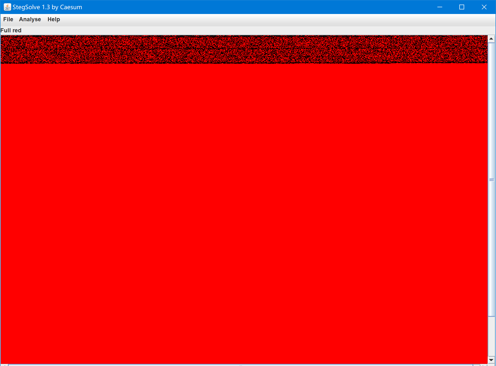
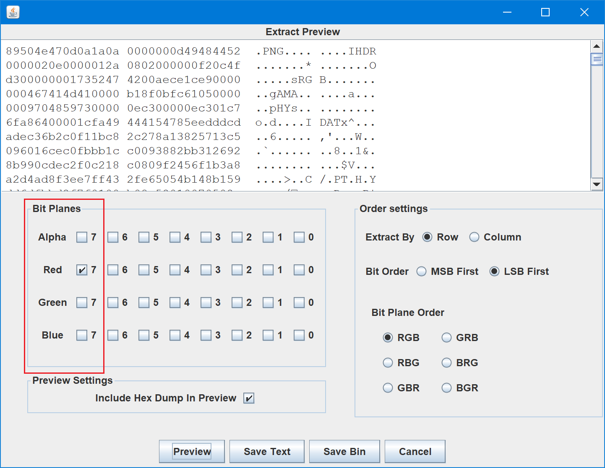
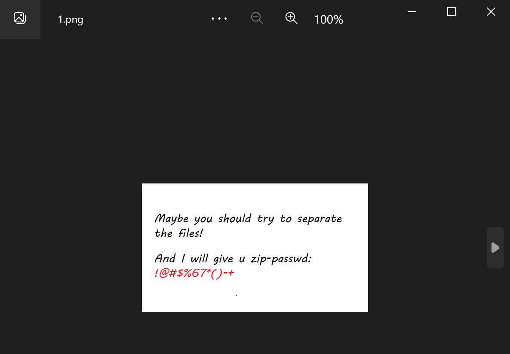
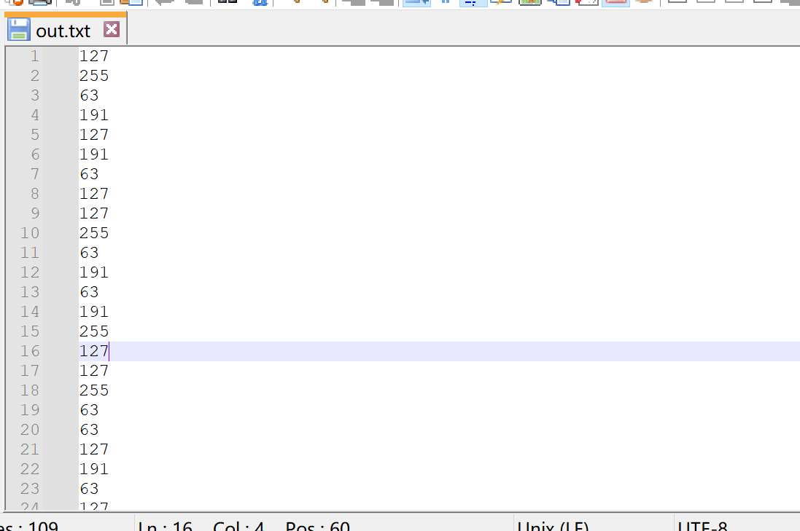
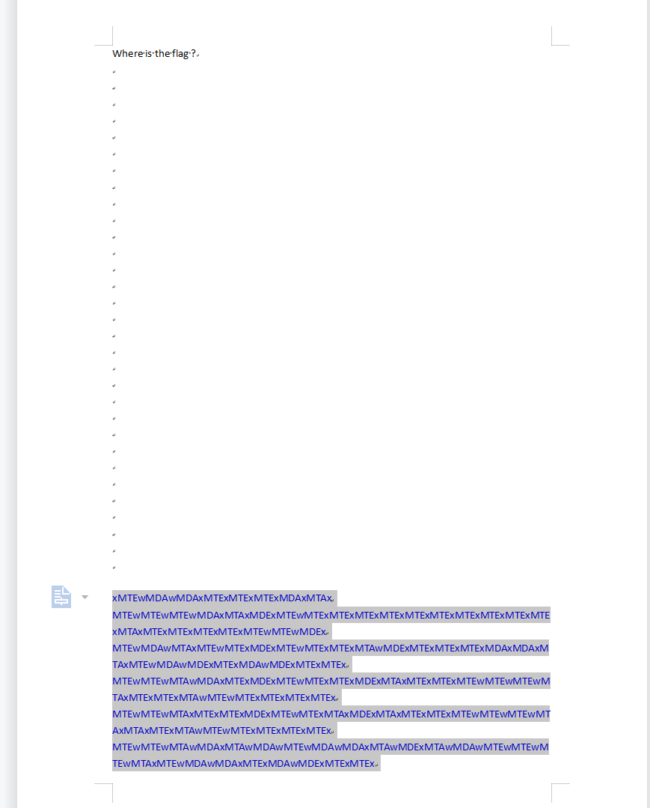
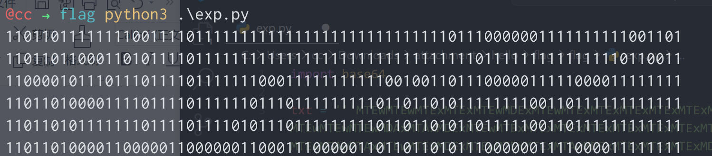
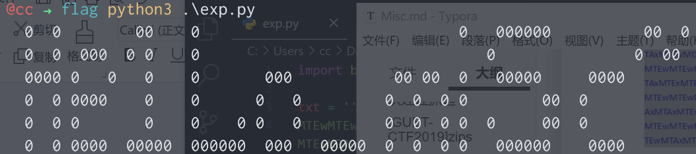

# [MRCTF2020]Hello_ misc

## 知识点

`图片隐写`

`TTL隐写`

`大文字`

## 解题

首先`010editor`发现有个合并文件`zip`文件

然后解压`zip`文件发现有密码,更改`伪加密`处依旧有代码

`stegsolve`看看,在`red`通道发现有隐藏信息



在`Red7`通道发现`png`文件



发现`png`文件中给出了压缩包密码





发现就是上一题的`TTL`隐写

```python
with open('out.txt','r') as Dec:
    res = ''
    for i in Dec.readlines():
        Bin = '{:08b}'.format(int(i))
        print(Bin)
        Sub_Bin = Bin[:-6]
        res += Sub_Bin
    print(res)

    for j in range(0,len(res),8):
        full_bin = res[j:j+8]
        print(chr(int(full_bin,2)),end="")

```

`rar-passwd:0ac1fe6b77be5dbe`

[参考](https://blog.csdn.net/mochu7777777/article/details/109680577)



```
MTEwMTEwMTExMTExMTEwMDExMTEwMTExMTExMTExMTExMTExMTExMTExMTExMTExMTAxMTEwMDAwMDAxMTExMTExMTExMDAxMTAx
MTEwMTEwMTEwMDAxMTAxMDExMTEwMTExMTExMTExMTExMTExMTExMTExMTExMTExMTExMTAxMTExMTExMTExMTExMTEwMTEwMDEx
MTEwMDAwMTAxMTEwMTExMDExMTEwMTExMTExMTAwMDExMTExMTExMTExMDAxMDAxMTAxMTEwMDAwMDExMTExMDAwMDExMTExMTEx
MTEwMTEwMTAwMDAxMTExMDExMTEwMTExMTExMDExMTAxMTExMTExMTEwMTEwMTEwMTAxMTExMTExMTAwMTEwMTExMTExMTExMTEx
MTEwMTEwMTAxMTExMTExMDExMTEwMTExMTAxMDExMTAxMTExMTExMTEwMTEwMTEwMTAxMTAxMTExMTAwMTEwMTExMTExMTExMTEx
MTEwMTEwMTAwMDAxMTAwMDAwMTEwMDAwMDAxMTAwMDExMTAwMDAwMTEwMTEwMTEwMTAxMTEwMDAwMDAxMTExMDAwMDExMTExMTEx
```



还以为是二进制转啥,其实是大文字

把`1`全部替换为`空格`



```python
import base64

txt = '''MTEwMTEwMTExMTExMTEwMDExMTEwMTExMTExMTExMTExMTExMTExMTExMTExMTExMTAxMTEwMDAwMDAxMTExMTExMTExMDAxMTAx
MTEwMTEwMTEwMDAxMTAxMDExMTEwMTExMTExMTExMTExMTExMTExMTExMTExMTExMTExMTAxMTExMTExMTExMTExMTEwMTEwMDEx
MTEwMDAwMTAxMTEwMTExMDExMTEwMTExMTExMTAwMDExMTExMTExMTExMDAxMDAxMTAxMTEwMDAwMDExMTExMDAwMDExMTExMTEx
MTEwMTEwMTAwMDAxMTExMDExMTEwMTExMTExMDExMTAxMTExMTExMTEwMTEwMTEwMTAxMTExMTExMTAwMTEwMTExMTExMTExMTEx
MTEwMTEwMTAxMTExMTExMDExMTEwMTExMTAxMDExMTAxMTExMTExMTEwMTEwMTEwMTAxMTAxMTExMTAwMTEwMTExMTExMTExMTEx
MTEwMTEwMTAwMDAxMTAwMDAwMTEwMDAwMDAxMTAwMDExMTAwMDAwMTEwMTEwMTEwMTAxMTEwMDAwMDAxMTExMDAwMDExMTExMTEx'''

b64_seg = txt.split('\n')
# print(b64_seg)c
for i, v in enumerate(b64_seg):
    print(base64.b64decode(b64_seg[i]).decode().replace('1', ' '))
```

