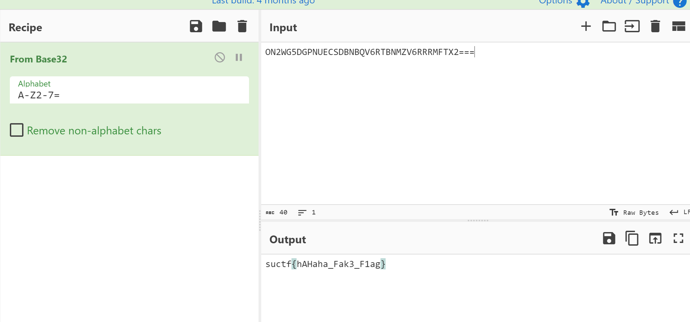
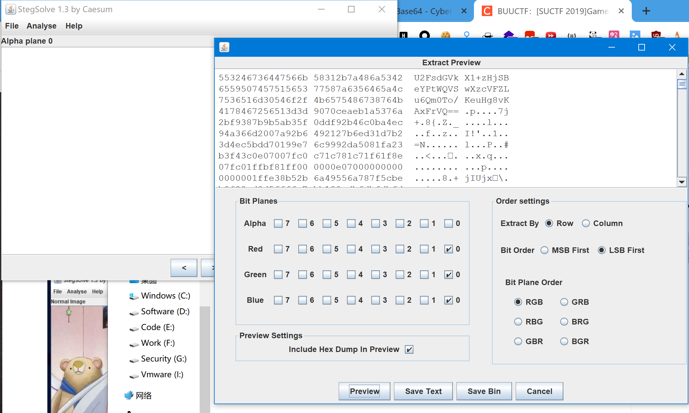
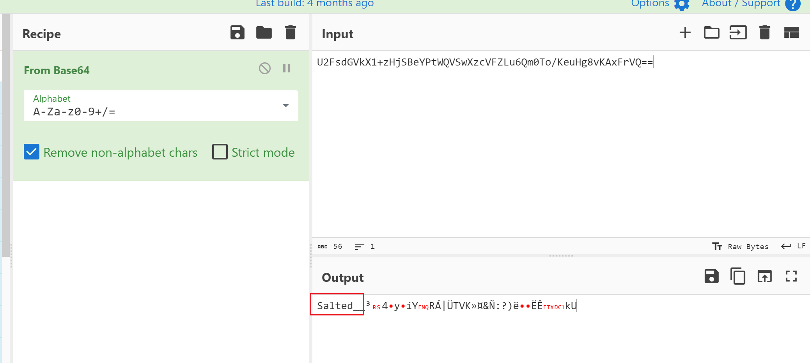
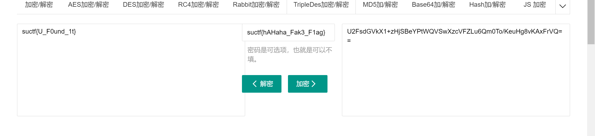

# [SUCTF 2019]Game

## 知识点

`lsb低位隐写`

`3DES密文特征Salted`

## 解题

首先在`src.zip`下面找到了一个`index.html`,`base32`解码成功

然后来看照片,`010editor`和`zsteg`都没找到什么东西

用`stegsolve`看看有没有`lsb低位隐写`

发现一串`base64`字符串

以`Salted`开头,可能是`AES`或`3DES`

https://www.sojson.com/encrypt_triple_des.html

