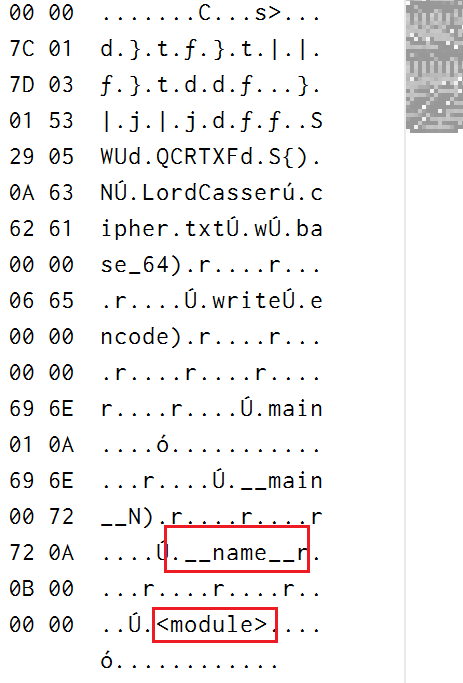

# [SUCTF2018]dead_z3r0

## 知识点

`剑龙隐写pyc`

## 解题

`trid`分析文件类型


没看懂是啥

再看看文件内容



看起来很像`pyc`文件

从`33 0D 0D 0A`开始分离,保存为`1.pyc`

使用`uncompyle6`转为`py`文件

```
uncompyle6.exe .\1.pyc > 1.py
```

```python
# uncompyle6 version 3.9.0
# Python bytecode version base 3.6 (3379)
# Decompiled from: Python 3.9.8 (tags/v3.9.8:bb3fdcf, Nov  5 2021, 20:48:33) [MSC v.1929 64 bit (AMD64)]
# Embedded file name: cycle.py
# Compiled at: 2018-11-01 19:20:56
# Size of source mod 2**32: 622 bytes


def encryt(key, plain):
    cipher = ''
    for i in range(len(plain)):
        cipher += chr(ord(key[i % len(key)]) ^ ord(plain[i]))

    return cipher


def getPlainText():
    plain = ''
    with open('plain.txt') as (f):
        while True:
            line = f.readline()
            if line:
                plain += line
            else:
                break

    return plain


def main():
    key = 'LordCasser'
    plain = getPlainText()
    cipher = encryt(key, plain)
    with open('cipher.txt', 'w') as (f):
        f.write(cipher.encode('base_64'))


if __name__ == '__main__':
    main()
# okay decompiling .\1.pyc
```

解密其实就是处理异或

```python
import base64

key = 'LordCasser'

cipher = 'KTswVQk1OgQrOgUVODAKFikZJAUuKzwPCTUxMQE1Kxc8NxYYPjcgQwY7OxMhCzFDLyYFGBYjKwkXMDALAScZEycyJgooOigHEAoSDT42IEcBLCcdDiUxBi8mBRgoLBUKPgowBR04P1QnJj0cLyYFGBYjJBs5JywFL1wjHhkbMkI8KhoWFjAWXH55'


plaintext = ''

res =  base64.b64decode(cipher).decode()
for i, v in enumerate(res):
    plaintext += chr(ord(key[i % len(key)]) ^ ord(res[i]))

print(plaintext)
```

得到结果是一串`base64`编码

```
eTB1JTIwNHIzJTIwZjAwbDNkJTBBdGgxNSUyMDE1JTIwbjB0JTIwdGhhdCUyMHkwdSUyMHdhbnQlMEE5MCUyMDBuJTIwZHVkMyUwQWM0dGNoJTIwdGgzJTIwc3QzZzA1YXVydTU=
```


被耍了

`剑龙隐写`


