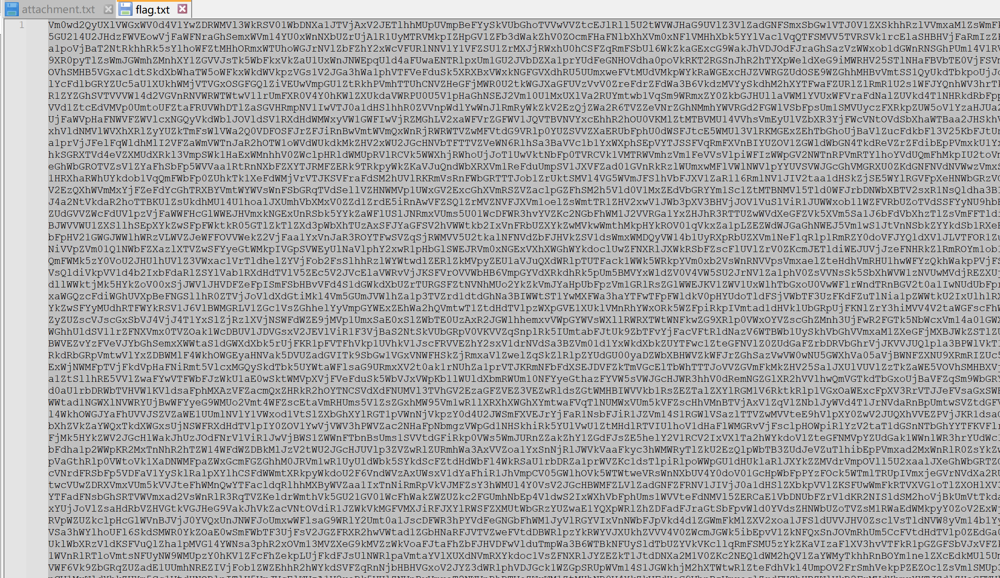

# [SWPU2019]Network

## 知识点

`TTL隐写`

`伪加密`

`多层base64解密`

## 解题

`TTL`隐写

```
    IP报文在路由间穿梭的时候每经过一个路由，TTL就会减1，当TTL为0的时候，该报文就会被丢弃。
    TTL所占的位数是8位，也就是0-255的范围，但是在大多数情况下通常只需要经过很小的跳数就能完成报文的转发，
    远远比上限255小得多，所以我们可以用TTL值的前两位来进行传输隐藏数据。
    如：须传送H字符，只需把H字符换成二进制，每两位为一组，每次填充到TTL字段的开头两位并把剩下的6位设置为1（xx111111），这样发4个IP报文即可传送1个字节。
```

根据上述规则，可以知道TTL隐写中用到四个值：`00 111111`（63）,`01 111111`（127）,`10 111111`（191）,`11 111111`（255）,解密的时候只取前两位，然后转换成ascii
简化一下，可以这么认为：
用

```
00 替换 63
01 替换 127
10 替换 191
11 替换 255
```

简化一下，可以这么认为：
用

```
00 替换 63
01 替换 127
10 替换 191
11 替换 255
```

于是可以写脚本：


```python
import binascii
f=open("attachment.txt","r")
f2=open("result.txt","wb")
num=''
res=''
for i in f:
    if int(i)==63:
        num+="00"
    if int(i)==127:
        num+="01"
    if int(i)==191:
        num+="10"
    if int(i)==255:
        num+="11"
for j in range(0,len(num),8):
    res += chr(int(num[j:j+8],2))#转换为字符
res = binascii.unhexlify(res)#unhexlify:从十六进制字符串返回二进制数据
f2.write(res)
```

发现结束后`010editor`查看后发现为`zip`文件,并且有`伪加密`

更改伪加密位后,更改后缀名为`zip`解压

得到一串字符串



有很多层`base64`,编写代码

```python
import base64

with open('./flag.txt', 'r') as f:
    b64 = f.read().strip()
    txt = b64
    while True:
        txt = base64.urlsafe_b64decode(txt)
        if "flag" in txt.decode():
            print(txt.decode())
            exit(0)
```

[参考文章](https://www.cnblogs.com/yunqian2017/p/14671031.html)