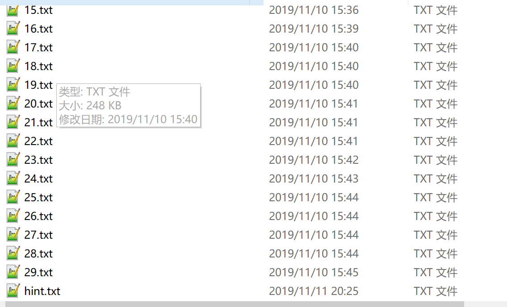
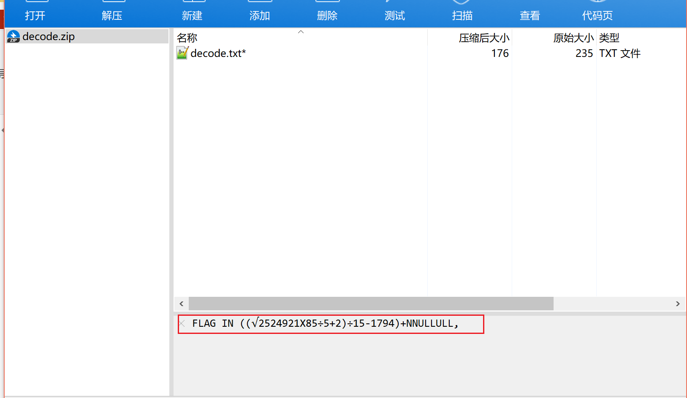
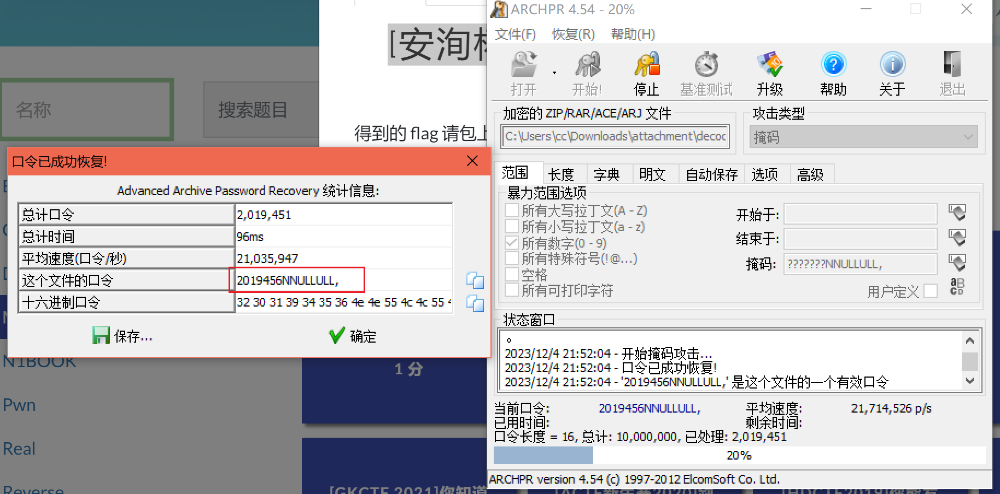

# [安洵杯 2019]easy misc

## 知识点

`字符串掩码`

`盲水印`

`词频统计`

## 解题

题目给了三个文件


`read`文件夹



`hint.txt`

```
hint:取前16个字符
```

应该是词频统计，取出现频率最高的前十六个字符

可不知道看哪一个`txt`文件

再看压缩包，加密，但注释有提示



```
(math.sqrt(2524921)*85/5+2)/15-1794
```


前面的算式解出来是`7`

`七个数字+字符串掩码`



替换表

```
a = dIW
b = sSD
c = adE 
d = jVf
e = QW8
f = SA=
g = jBt
h = 5RE
i = tRQ
j = SPA
k = 8DS
l = XiE
m = S8S
n = MkF
o = T9p
p = PS5
q = E/S
r = -sd
s = SQW
t = obW
u = /WS
v = SD9
w = cw=
x = ASD
y = FTa
z = AE7
```

最后是那张`png`

`foremost`分离出两张一样的`png`，盲水印


`词频统计脚本`

```python
import re

file = open('D:/edge/read/11.txt')    
line = file.readlines()
file.seek(0,0)
file.close()

result = {}
for i in range(97,123):
    count = 0
    for j in line:
        find_line = re.findall(chr(i),j)
        count += len(find_line)
    result[chr(i)] = count
res = sorted(result.items(),key=lambda item:item[1],reverse=True)

num = 1
for x in res:
        print('频数第{0}: '.format(num),x)
        num += 1
```

```python
import re

file = open('./11.txt')    
line = file.readlines()
file.seek(0,0)
file.close()

result = {}
for i in range(97,123):
    count = 0
    for j in line:
        find_line = re.findall(chr(i),j)
        count += len(find_line)
    result[chr(i)] = count
res = sorted(result.items(),key=lambda item:item[1],reverse=True)

num = 1

result = ''

for i, x in enumerate(res):
        # print('频数第{0}: '.format(num),x)
        if i < 15:
            result += x[0]
        num += 1
        
# print(result)

tables = '''a = dIW
b = sSD
c = adE 
d = jVf
e = QW8
f = SA=
g = jBt
h = 5RE
i = tRQ
j = SPA
k = 8DS
l = XiE
m = S8S
n = MkF
o = T9p
p = PS5
q = E/S
r = -sd
s = SQW
t = obW
u = /WS
v = SD9
w = cw=
x = ASD
y = FTa
z = AE7'''

tb = {}

for data in tables.split('\n'):
    tb[data.strip().replace(' ', '').split('=')[0]] = data.strip().replace(' ', '').split('=')[1]

# print(tb)
for s in result:
    for k, v in tb.items():
        if k == s:
            print(v, end='')
        
```

```
QW8obWdIWT9pMkF-sd5REtRQSQWjVfXiE/WSFTajBtcw
```

`base64`解密后`base85`解密

```
flag{have_a_good_day1}
```

我解密就异常了,挺奇怪