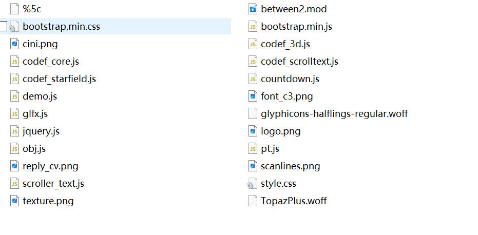
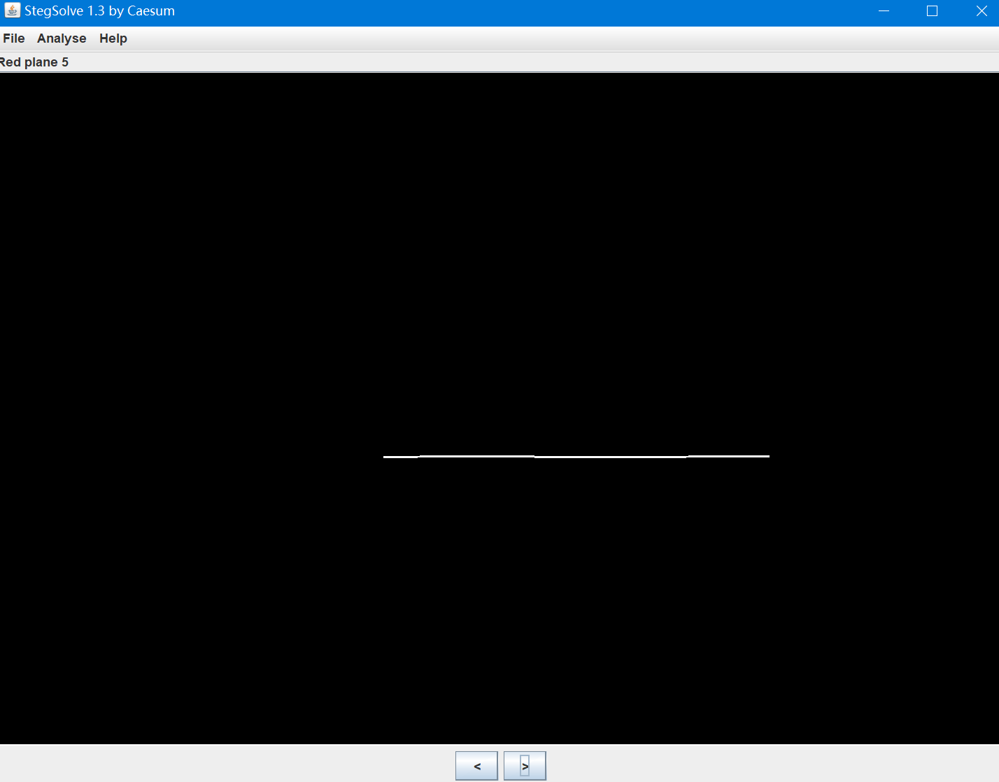
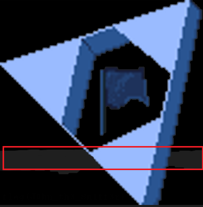
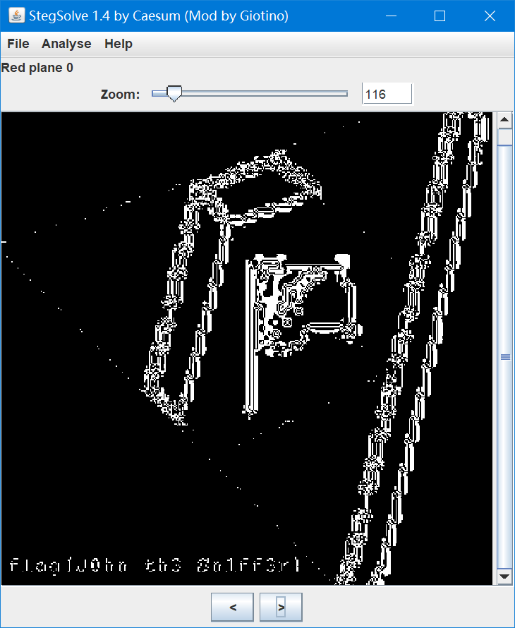
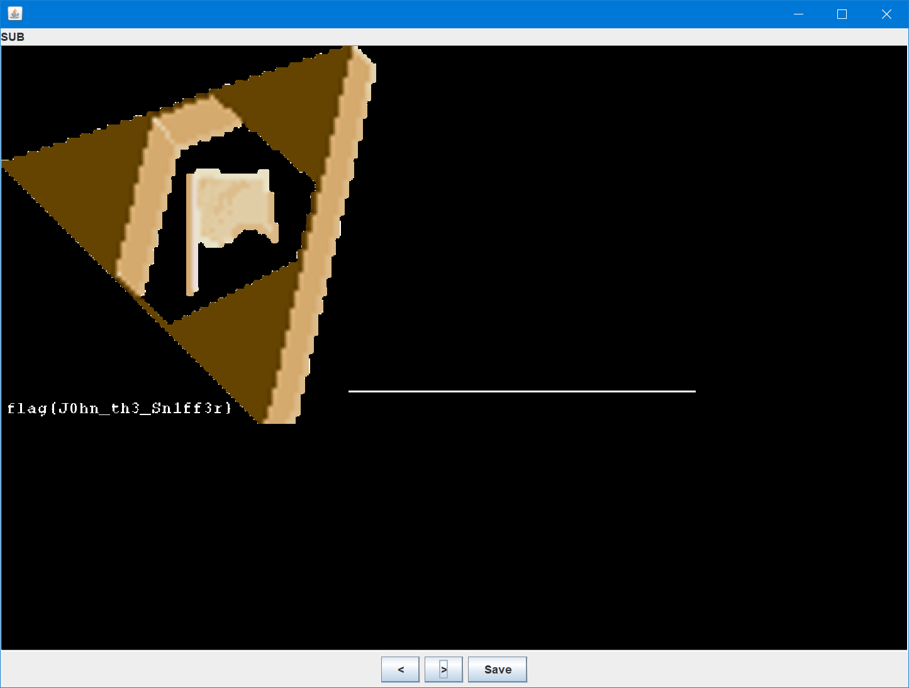

# john-in-the-middle

## 知识点

`流量包分析`

`图片组合`

## 解题

可以看到都是`HTTP`的数据包，导出`HTTP`得到如下：

使用`stegslove`打开`scanlines.png`，在很[多通道](https://so.csdn.net/so/search?q=多通道&spm=1001.2101.3001.7020)都发现了一条线

`logo.png`图片中有条缺口

其实这个也勉强能看出来

将两张图片使用`stegslove`进行`Image Combiner`进行对比

`scanlines.png` `SUB` `logo.png`找到

