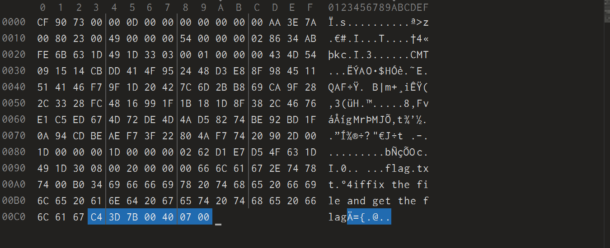
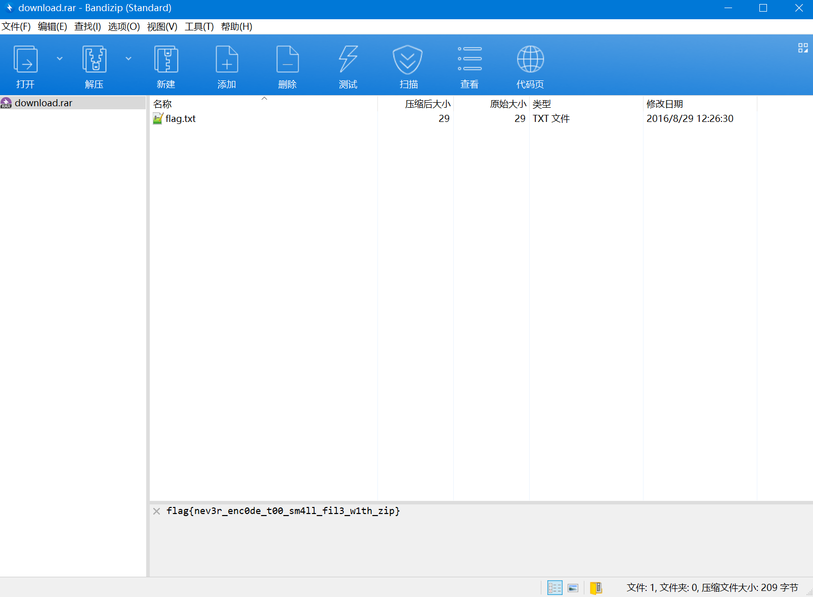

# zip

## 知识点

`CRC32爆破`

`根据文件尾添加文件头`

## 解题

很多压缩包，但是里面的内容非常小，小于5字节，可以尝试使用`CRC32爆破`得到其内容

```python
import zipfile
import os
import itertools
import string
import binascii

f = open('out.txt', 'w')

dic = string.ascii_letters + string.digits + '+/='

def crack_crc(crc):
    for i, j, k, h in itertools.product(dic, dic, dic, dic):
        s = i + j + k + h
        if crc == (binascii.crc32(s.encode())):
            return s


# crc = zipfile.ZipFile('./out0.zip', 'r').getinfo('data.txt').CRC

for i in range(0, 68):
    filename = 'out%s.zip'%i
    res = crack_crc(zipfile.ZipFile(filename, 'r').getinfo('data.txt').CRC)
    f.write(res)
    print(f'loading {filename}')

print('Finish...')
f.close()
```



文件尾是`rar`的文件尾,加一个`rar`的文件头

压缩包注释中有`flag`

