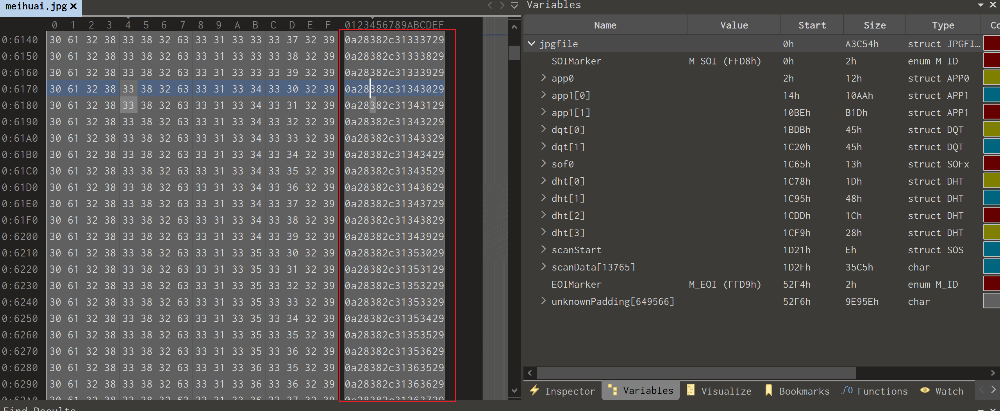
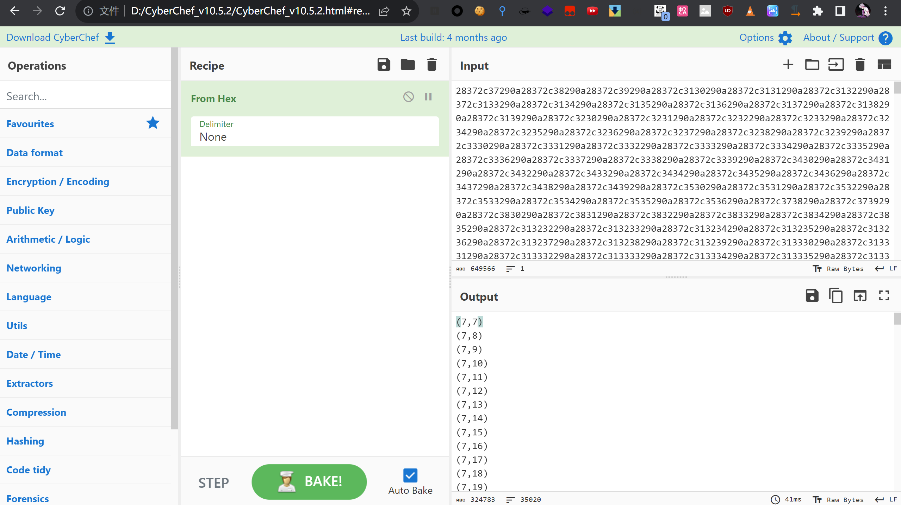
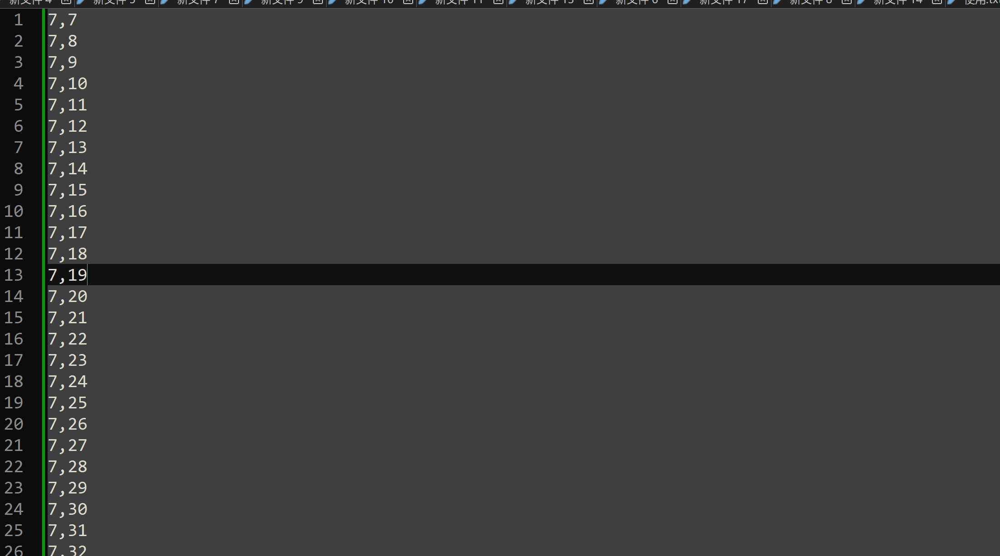

# 梅花香之苦寒来

## 知识点

`hex坐标`

## 解题



图内有大量`hex`数据

`hex`解密后为`坐标`



看来需要画图了

`matplotlib`绘图

去除文本左右的`(`和`)`



```python
import matplotlib.pyplot as plt
import numpy as np


# 用不了
# x = []
# y = []

# with open('./res.txt', 'r') as f:
#     txt = f.read().strip().replace('(', '').replace(')', '').split('\n')
#     for t in txt:
#         x.append(t.split(',')[0])
#         y.append(t.split(',')[1])
#     print(x[:5])
#     print(y[:5])
    
#     plt.plot(x, y, '.')
#     plt.show()

x, y = np.loadtxt('./res.txt', delimiter=',', unpack=True)

plt.plot(x, y, '.')
plt.show()
```

`QR Research`解码即可