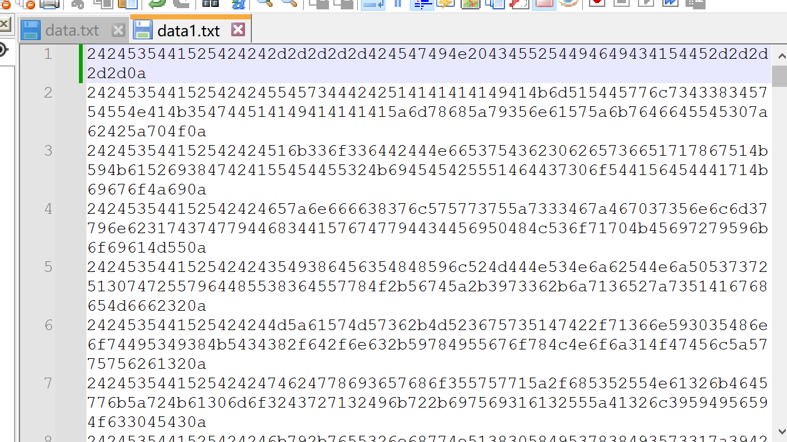
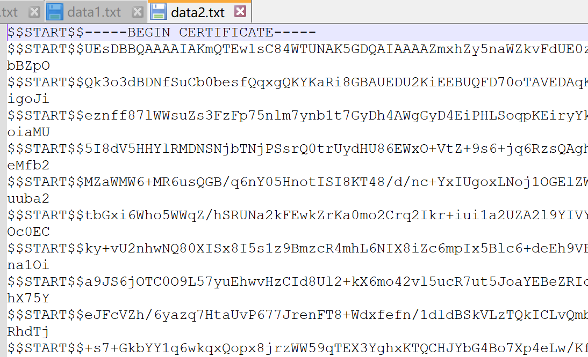

# 蜘蛛侠呀

## 知识点

`HTTP流量分析`

`数据处理`

`时间隐写`

## 解题

所有的`icmp`包后面都跟了一串数据，使用`tshark`把这些全部提取出来

```bash
tshark -r out.pcap -T fields -e data > data.txt
```

发现有重复,去重

```python
with open('data.txt', 'r') as file:
    res_list = []
    lines = file.readlines()
    print('[+]去重之前一共{0}行'.format(len(lines)))
    print('[+]开始去重，请稍等.....')
    for i in lines:
        if i not in res_list:
            res_list.append(i)
    print('[+]去重后一共{0}行'.format(len(res_list)))
    print(res_list)

with open('data1.txt', 'w') as new_file:
    for j in res_list:
        new_file.write(j)
```



`16进制`转字符串

```python
from Crypto.Util.number import long_to_bytes
import binascii


write_file = open('./data2.txt', 'w')

with open('./data1.txt', 'r') as f:
    lines = f.read().strip().split('\n')
    for _, v in enumerate(lines):
        # long_to_bytes(v)
        data = binascii.unhexlify(v).decode()
        write_file.write(data)
    write_file.close()
```



去掉首尾两行,再去掉`$$START$$`和`换行符`,`base64`解码

```python
import base64

with open('./data2.txt', 'rb') as f:
    with open('res.zip','wb') as new_file:
        new_file.write(base64.b64decode(f.read()))
```


`时间隐写`,使用`identify`

```bash
identify -format "%T" flag.gif
2050502050502050205020202050202020205050205020502050205050505050202050502020205020505050205020206666
```

`20`替换为`0`
`50`替换为`1`

```
011011010100010000110101010111110011000101110100
```

```
In [3]: int('011011010100010000110101010111110011000101110100', 2)
Out[3]: 120139720634740

In [4]: hex(120139720634740)
Out[4]: '0x6d44355f3174'

In [5]: import binascii

In [6]: binascii.unhexlify("6d44355f3174")
Out[6]: b'mD5_1t'
```

[参考文章](https://blog.csdn.net/mochu7777777/article/details/109645038)