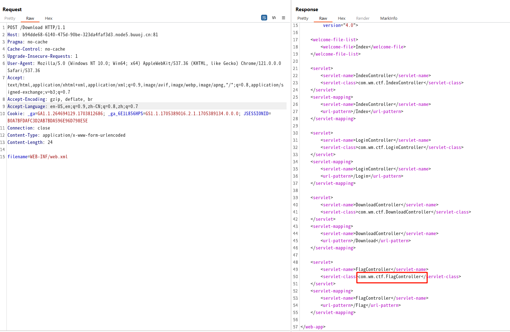

# [RoarCTF 2019]Easy Java

## 知识点

`javaweb`

`任意文件下载`

`反编译class文件`

## 解题

题目是登陆页面，查看源码，发现一个连接`Download?filename=help.docx`，跳转到帮助文档。
点击help也可以跳转到帮助文档。
帮助文档内容为`java.io.FileNotFoundException:{help.docx}`，是java语句，帮助文档不存在。发现报错类型为`java`报错信息，尝试下载`java web`中的信息目录，一般在`WEB-INF/web.xml`中

先访问`WEB-INF/web.xml`

#### [WEB-INF知识点](https://www.cnblogs.com/darkcyan/p/17668377.html#web-inf知识点)

`WEB-INF`是`java`的`WEB`应用的安全目录，此外如果想在页面访问`WEB-INF`应用里面的文件，必须要通过`web.xml`进行相应的映射才能访问。

其中敏感目录举例：

> `/WEB-INF/web.xml`：`Web`应用程序配置文件，描述了 `servlet` 和其他的应用组件配置及命名规则
> `/WEB-INF/classes/`：含了站点所有用的 `class`文件，包括`servlet class` 和非`servlet class`，他们不能包含在`.jar`文件中
> `/WEB-INF/lib/`：存放`web`应用需要的各种`JAR`文件，放置仅在这个应用中要求使用的`jar`文件,如数据库驱动`jar`文件
> `/WEB-INF/src/`：源码目录，按照包名结构放置各个`java`文件
> `/WEB-INF/database.properties`：数据库配置文件

简单来说，`java web`是基于`Tomcat`服务器搭建的，通过`servlet`来开发。
狭义来说，`servlet`是指`Java`语言实现的一个接口。

访问方式

> `<servlet-class>`  这个就是指向我们要注册的`servlet` 的类地址, 要带包路径
>
> `<servlet-mapping>`  是用来配置我们注册的组件的访问路径,里面包括两个节点 一个是`<servlet-name>`，这个要与前面写的`servlet`一致 另一个是`<url-pattern>`，配置这个组件的访问路径 `<servlet-name>` 这个是我们要注册`servlet`的名字,一般跟`Servlet`类名有关
>
> 举个例子
> <servlet>
> <servlet-name>FlagController</servlet-name>
> <servlet-class>com.wm.ctf.FlagController</servlet-class>
> </servlet>

`servlet`包含了路径信息，我们尝试包含一下`FlagController`所在路径，不过这次要在前面加上`classes`来访问来访问`class`文件目录（详见上面的目录结构），且文件后缀为`.class`

首先去找`WEB-INF/web.xml`

需要用`POST`方法(看文档也没人说为啥要改为`POST`)，

`com.wm.ctf.FlagController`更改下载路径为`WEB-INF/classes/com/wm/ctf/FlagController.class`

或者下载后用`jadx-gui`反编译

将`ZmxhZ3tjNmRkMGQ4Zi01YTQ4LTQ3MjQtYjIwOC04MGE2OTlkZmE1YWR9Cg==`进行`base64`解码即可

[参考文章](https://www.cnblogs.com/darkcyan/p/17668377.html)