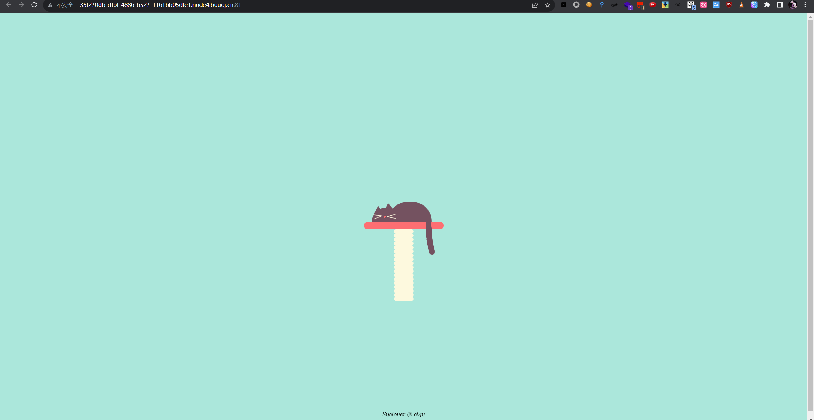
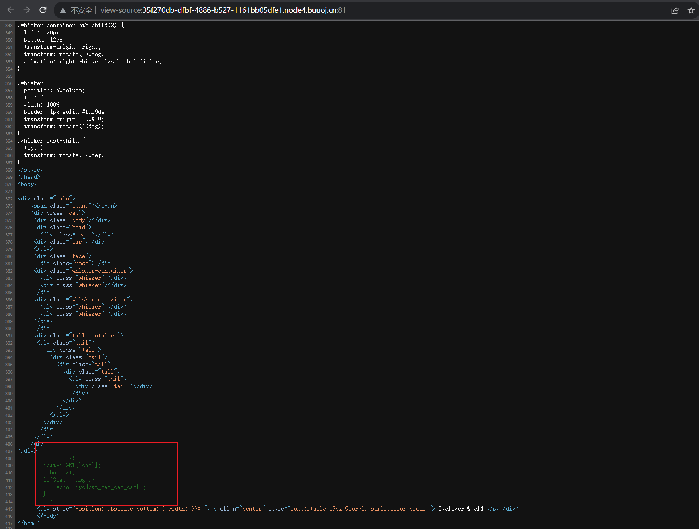
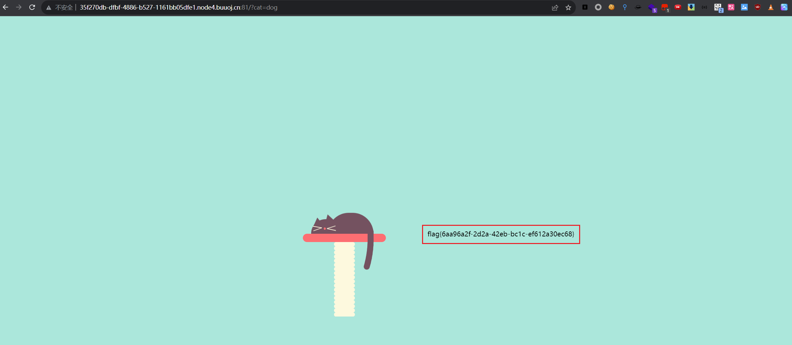

# [极客大挑战 2019]Havefun

## 知识点

`传参`
`源码`

## 解题



没找到什么东西，查看一下源代码



查看到一串`php`代码

```php
<?php
    $cat=$_GET['cat'];
    echo $cat;
    if($cat=='dog'){
    echo 'Syc{cat_cat_cat_cat}';
}
```

传参`cat=dog`



直接拿到`flag`
